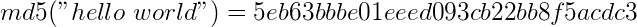

# [Cryptography](https://fr.wikipedia.org/wiki/Cryptographie)

## Terminology

- **Plaintext**: data with no encryption.

- **Ciphertext**: encrypted data.

- **Cryptography**: study of techniques for secure communication, used to preserve **integrity** and **confidentiality** of sensitive information.

> _"A cryptosystem should be secure even if everything about the system, except the key, is public knowledge"_ [Kerckhoffs's principle](https://en.wikipedia.org/wiki/Kerckhoffs%27s_principle)

- **Cryptanalysis**: set of methods tp attack cryptography by finding weaknesses in the underlying maths. Retrieving clear information without knowing the decryption key. 

- **Encoding**: (NOT a form of encryption) just a form of data representation such as **base64**. This is reversible.

- **Key**: sensitive data that is needed for encryption and/or decryption.

- **Passphrase**: similar to a password, used to protect a key.

- **Steganography**: hiding the existence of the message.

> Example of Histiee: shave the head of a slave, tattoo the message on his head, wait for the hair to grow back.

## Hashing

A **hash** is the output of a hash function. 

In principle, it's irreversible based on the mathematical problem [P vs NP relationship](https://en.wikipedia.org/wiki/P_versus_NP_problem).

A hash function takes an input _(strings, files, etc)_ and outputs a hash (fixed length string/hexadecimal number).



> Bunch of different algorithms are used for hashing: `md5`, `sha1`, `sha256`, etc.

In opposite to encryption, there is no key, and it's meant to be impossible (or very very difficult) to go from the hash to the input.

**Any small change in the input data (even a single bit) should cause a large change in the output.**

> Tools like [hashID](https://pypi.org/project/hashID/), [hash_identifier](https://hashes.com/en/tools/hash_identifier) or this [one](https://gitlab.com/kalilinux/packages/hash-identifier/-/tree/kali/master) can be used to recognize which hashing function has been used.

> Different hash formats can be found here: <https://hashcat.net/wiki/doku.php?id=example_hashes>

### Uses of hash functions

There are 2 main reasons of using hash functions:

1. Verifying data **integrity**
2. Verifying passwords without storing them in plaintext

#### Integrity checking

Since for the same input you will get the same output/hash, hash functions can be used to check if a file has been modified.

> For instance, to ensure we've downloaded the file correctly.

It can also be used to find duplicate files.

> TODO: write about **Secure Boot**, **Signatures** and **HMAC**...

#### Password verification

Passwords are stored in databases as **hashes** in order to prevent the website admin to know your passwords and to protect them in case there is a database leak.

> The wordlist "`rockyou.txt`" comes from a databreach where passwords were stored in plaintext.

> Unix passwords are stored in `/etc/shadow` following this format: `$hashingalgorithmID$rounds$salt$hash`. Only root user can read this file.

> Windows passwords are hashed using NTLM and password hashes are stored in the **SAM** (Security Accounts Manager). Windows tries to prevent normal users from dumping them, but tools like `mimikatz` can help to do this. 

Password verification will be performed using **hash function**: if the output of the hash function (using the password you sent to log) is the same as the hash stored in the database, then it will consider that the password is correct.

> Here it comes the subject of **collisions**...

### Collisions

Since your password could be any string (so basically all the possibilities are an infinite set), and hashes have a fixed size (set with limited elements), there could be **collisions** &rarr; **two inputs having the same output/hash**.

> https://www.mscs.dal.ca/~selinger/md5collision/

> https://shattered.io/

### Rainbow tables

A **rainbow table** is basically  a collection of **precomputed hashes**.

A rainbow table is a pre-generated list of hash inputs to outputs, to quickly be able to look up an input (in this case, a password) from its hash.

It can be used by attackers to "crack" passwords.

> https://crackstation.net/

> https://nakedsecurity.sophos.com/2013/11/04/anatomy-of-a-password-disaster-adobes-giant-sized-cryptographic-blunder/

To prevent this we can use a "**salt**", a random value (unique to each user) that we concatenate with user's password before using the hash function.

> Hash functions like bcrypt and sha512crypt handle this automatically.

> Salts don’t need to be kept private.

> Tools like `hashcat` or `john` can help to "crack" hashes.

___

## Encryption

There are two main categories for encryption: 

1. **Symmetric encryption** &rarr; relies on the same key to encrypt and decrypt data.

> Examples are `AES`, `DES` (broken)...

2. **Asymmetric encryption** &rarr; relies on two different keys: one to encrypt (**public key**) and one to decrypt (**private key**).

> Examples are `RSA`, `Elliptic Curve`...

Symmetric encryption tend to be faster than Asymmetric encryption due to math complexity.

A big concern with symmetric encryption is **how to exchange the key securely?**

Those are the reasons why asymmetric encryption is often used to exchange a symmetric key by using key exchange algorithms.

This is how `HTTPS` works under the hood. `HTTPS` relies on **SSL/TLS** for encryption.

> [How does HTTPS actually work?](https://robertheaton.com/2014/03/27/how-does-https-actually-work/)

**SSL/TLS** relies on **digital signatures** and **certificates**.

> An important thing to remember about modulo is not reversible. If I gave you an equation: `x % 5 = 4`, there are infinite values of x that will be valid.

### RSA

RSA is based on the mathematically difficult problem of working out the factors of a large number.

The key variables that you need to know about for RSA in CTFs are `p`, `q`, `m`, `n`, `e`, `d`, and `c`.

- `p` and `q` are large prime numbers.
- `n` is the product of p and q.
- the public key is `n` and `e`.
- the private key is `n` and `d`.

`m` is used to represent the message (in plaintext) and `c` represents the ciphertext (encrypted text).

> [RsaCtfTool](https://github.com/Ganapati/RsaCtfTool)

### Digital signatures

**Digital signatures** are a way to prove the authenticity of files, to prove who created or modified them. 

The simplest form of digital signature would be encrypting a document with your private key, and then if someone wanted to verify this signature they would decrypt it with your public key and check if the files match.

As only you should have access to your private key, this proves you signed the file. 

### Digital certificates

**Digital certificates** have a chain of trust, starting with a root CA (**certification authority**). 

Root CAs are automatically trusted by your device, OS, or browser from install. 

Certs below that are trusted because the Root CAs say they trust that organisation. 

Certificates below that are trusted because the organisation is trusted by the Root CA and so on.

### Diffie Hellman Key Exchange

Exchanging a symmetric key without using asymmetric encryption? Here comes [Diffie–Hellman](https://en.wikipedia.org/wiki/Diffie%E2%80%93Hellman_key_exchange).

[](https://www.youtube.com/watch?v=NmM9HA2MQGI)

___

## PGP

`PGP` stands for Pretty Good Privacy. It’s a software that implements encryption for encrypting files, performing digital signing and more.

> `GnuPG` or `GPG` is an Open Source implementation of `PGP` 

```console
root@kali:~/thm/crypto101# gpg --import tryhackme.key
gpg: key FFA4B5252BAEB2E6: "TryHackMe (Example Key)" not changed
gpg: key FFA4B5252BAEB2E6: secret key imported
gpg: Total number processed: 1
gpg:              unchanged: 1
gpg:       secret keys read: 1
gpg:  secret keys unchanged: 1
root@kali:~/thm/crypto101# gpg --decrypt message.gpg 
gpg: encrypted with 1024-bit RSA key, ID 2A0A5FDC5081B1C5, created 2020-06-30
      "TryHackMe (Example Key)"
You decrypted the file!
The secret word is Pineapple.
```

___

## Quantum Computers

- **NIST** has resources that detail what the issues with current encryption is and the currently proposed solutions for these: <https://doi.org/10.6028/NIST.IR.8105>

RSA or Elliptical Curve Cryptography will be very fast to break with quantum computers.

> The NSA recommends using RSA-3072 or better for asymmetric encryption and AES-256 or better for symmetric encryption. 

> There are several competitions currently running for quantum safe cryptographic algorithms, and it’s likely that we will have a new encryption standard before quantum computers become a threat to RSA and AES.

___

## Useful links

- [cryptohack.org](https://cryptohack.org/challenges/)
- [dCode](https://www.dcode.fr/)
- [**John Hammond** - Cryptography (CTF WU)](https://www.youtube.com/watch?v=p__QZIxjHMk&list=PL1H1sBF1VAKU05UWhDDwl38CV4CIk7RLJ)
- [PCI-DSS standard](https://www.pcisecuritystandards.org/documents/PCI_DSS_for_Large_Organizations_v1.pdf)
- [THM - crypto101 room](https://tryhackme.com/room/encryptioncrypto101)