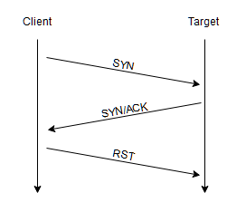
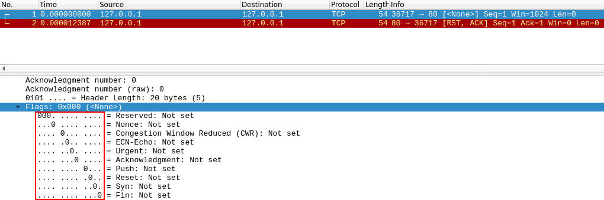
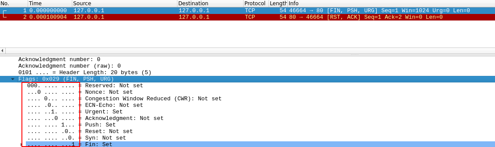

# Port scanning with `nmap`

"Knowledge is power"

"Enumeration is the key"

## Why `nmap`?

`nmap` is currently the industry standard. 

It offers a lot of functionalities: scanning for vulnerabilities and in some cases it can also performs exploit directly.

There are [alternatives tools](#alternatives) that do not necessarily offers as much functionalities, even though they can be faster.

## Ports

When a computer runs a network service, it opens a networking construct called a "**port**" to receive the connection.

A port can be in different states:
- **open**: by sending a packet with the SYN flag, we receive SYN/ACK.
- **closed**: If you send a SYN to a closed port, it will respond back with a RST _(Reset flag)_.
- **filtered**: Presumably, the host is behind some sort of firewall. Here, the packet is simply dropped and you receive no response (not even a RST).

There are **65535** available ports on every computer.

___

## Scan types

### TCP scans

- `-sT`: TCP Connect Scans _(perform a full three-way handshake)_

Quick **reminder**: TCP three-way handshake


___

- `-sS`: SYN "Half-open"/"Stealth" Scans _(sends back a RST TCP packet after receiving a SYN/ACK)_




> SYN scans are **significantly faster** than a standard TCP Connect scan as they do not perform a full three-way handshake. 

> Used to **bypass some old IDS** as they are looking out for a full three way handshake.

> Standard practice is to log a connection once it's been fully established, so SYN scans are **often not logged** by applications listening on open ports.

> **Cons**: requires  sudo permissions on Linux systems since we're sending a raw packet and unstable services can be brought down by SYN scans.

___

Stealthier and less commonly used scans which are expecting a RST if the port is closed (goal &rarr; **firewall evasion**):

- `-sN`: TCP Null Scans _(sent with no flags set at all)_



- `-sF`: TCP FIN Scans _(sent with the FIN flag &rarr; used to gracefully close an active connection)_


- `-sX`: TCP Xmas Scans _(sends a malformed TCP packet with PSH, URG and FIN flags)_



> Whether the port is actually open or not, Windows (plus some Cisco devices) respond with a RST to any malformed TCP packet.

___

### UDP scans

UDP connections are stateless.

- `-sU`: UDP Scans
    + if no response occurs, the port is considered as `open|filtered`.
    + if there is a response (very unusual), the port is considered as `open`.
    + `closed` UDP ports will generally respond with an ICMP (ping) packet saying that the port is unreachable.

> Significantly slower than TCP scans.

> A good practice will be : `--top-ports <number>`

___

### ICMP scanning

**Objective**: given a range of IP addresses, we want to see which IP addresses contain active hosts

- `-sn`: performing a "**ping sweep**"
    + Examples: 
        * `nmap -sn 192.168.0.1-254` 
        * `nmap -sn 192.168.0.0/24` 

> waiting for ICMP echo packets (or ARP requests on a local network, if run as the super user)

___

## Nmap Scripting Engine (NSE)

[**NSE Scripts**](https://nmap.org/book/nse-usage.html) are written in `Lua` and are located in `/usr/share/nmap/scripts` on Linux systems.

They are used to perform vulnerabilities scanning, and even to exploit vulnerabilities directly.

Main categories are:

Category      | Description
--------------|----------
`safe`        | Won't affect the target
`intrusive`   | Not safe: likely to affect the target
`vuln`        | Scan for vulnerabilities
`exploit`     | Attempt to exploit a vulnerability
`auth`        | Attempt to bypass authentication for running services (e.g. Log into an FTP server anonymously)
`brute`       | Attempt to bruteforce credentials for running services
`discovery`   | Attempt to query running services for further information about the network (e.g. query an SNMP server).

They can run as follows:

```bash
nmap --script=<script-name>,<other-script-name>  $TARGET
```

> Some scripts require arguments (for example, credentials, if they're exploiting an authenticated vulnerability). These can be given with `--script-args`

- Examples:

    ```bash
    nmap -p 80 --script http-put --script-args http-put.url='/dav/shell.php',http-put.file='./shell.php' $TARGET
    ```
    + When looking for a script:
        * `grep "ftp" /usr/share/nmap/scripts/script.db`
        * `grep "safe" /usr/share/nmap/scripts/script.db` (category)
        * `ls -l /usr/share/nmap/scripts/*ftp*`

We can use `nmap --script-help <script-name>` to know more about a specific script.

Downloading a specific script not installed locally: 

```bash
$ sudo wget -O /usr/share/nmap/scripts/<script-name>.nse https://svn.nmap.org/nmap/scripts/<script-name>.nse
$ nmap --script-updatedb
```

___

## Firewall Evasion

> Need to read <https://nmap.org/book/man-bypass-firewalls-ids.html>

- Stealth scans such as NULL, FIN and Xmas.

- Firewall can block all ICMP packets. By default, `nmap` will ping the target. This can result in not scanning a potential alive host. The `-Pn` can help to overcome this.

> If we're already on the local network, we can use ARP requests with `nmap` to determine host activity.

- `-f`: fragment the packets (i.e. split them into smaller pieces) so that IDS/firewalls are less likely to detect them. _An alternative could be `--mtu <number>` (number needs to be a multiple of 8)

- `--scan-delay <time>ms`: add a delay between packets sent

- `--badsum`: determine the presence of a firewall/IDS by sending invalid checksum for packets, because they may automatically respond.

- `--data-length <number>`: append random data to sent packets in order to make a scan slightly less conspicuous

___

## Alternatives

- [masscan](https://github.com/robertdavidgraham/masscan#masscan-mass-ip-port-scanner)
- [RustScan](https://github.com/RustScan/RustScan)

___

## Resources / Useful links

- [RFC793](https://tools.ietf.org/html/rfc793)
- [THM - Further Nmap room](https://tryhackme.com/room/furthernmap)
- [HTB Academy - Nmap module](https://academy.hackthebox.eu/course/preview/network-enumeration-with-nmap)
- [Nmap NSEDoc](https://nmap.org/nsedoc/)
- [Nmap doc - Firewall/IDS Evasion and Spoofing](https://nmap.org/book/man-bypass-firewalls-ids.html)