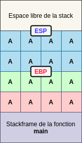
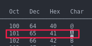

# [Pwn](https://en.wikipedia.org/wiki/Pwn)

> _"Segmentation fault"_ est une erreur que tous ceux qui ont déjà programmé en C ont certainement rencontrés. Le **segfault** signifie que <u>le programme a tenté d'accéder à une zone mémoire auquel il n'est pas censé avoir accès</u>.

L'objectif de ces notes est d'expliquer les failles de type **Buffer Overflow**, de passer en revue les protections mises en œuvres au cours de ces dernières années _(NX bit, canary, ASLR)_ ainsi que leurs contournements.

<!-- ## Un peu d'histoire

- 1988 - [**MORRIS**](http://ftp.cerias.purdue.edu/pub/doc/morris_worm/) 
- 1996 - [Smashing the stack for fun and profit](#)
... -->

## Stack Buffer Overflow

### Définitions

- **Buffer**: zone mémoire _(de taille prédéfinie)_ servant à stocker des données. _Exemple: `argv` est un buffer qui sert à stocker les arguments passées au programme_.


- **Stack**: segment de la mémoire sur lequel s'empile des données locales _(variables, arguments)_ à <u>chaque appel de fonction</u>. Chaque nouvel appel de fonction créé une "zone de travail" appelée **_stackframe_**, délimitée par un pointeur vers le sommet de la _stack_ (**ESP**) et un pointeur vers le bas de la _stackframe_ (**EBP**). _La stack grandit des adresses hautes vers les adresses basses._ 

> Sur une architecture 64 bits, **ESP** devient **RSP** et **EBP** devient **RBP**.

Pour que la fonction appelante puisse reprendre son cours d'exécution, on "**push**" **EIP** _(adresse de la prochaine instruction à exécuter)_ puis **EBP** sur la _stack_, enfin on créé la _stackframe_. ESP est alors écrasé avec la valeur d'EBP _(ils pointent vers la même case mémoire, la stackframe est donc vide)_. Ensuite, les variables locales à la fonction sont ajoutées une à une dans la stackframe courante. Enfin, durant l'exécution de la fonction appelée, on "**pop**" les valeurs de la stackframe une à une jusqu'à dépiler EBP et EIP pour continuer l'exécution de la fonction appelante. 

> Ceci afin qu'ESP et EBP repointent vers le haut et le bas de la stackframe précédente et qu'EIP pointe vers l'instruction suivant l'appel de fonction. 

<u>Résumé</u>:

1. `push eip`
2. `push ebp`
3. `mov ebp, esp` &rarr; _création de la stackframe (ESP = EBP)_
4. Push arguments de la fonction + variables globales <!-- Revoir l'ordre  -->
5. Pop arguments de la fonction + variables globales <!-- Revoir l'ordre  -->
6. `pop ebp`
7. `ret` _alias de `pop eip`_

**Exemple**:

```c
void f1(char *str)
{
    char buffer[8];
}

void main(int argc, char *argv[])
{
    f1(argv[1]);
}
```


<u>**Question**</u>: Tout va bien si le buffer est inférieur à 8 octets mais que se passe-t-il s'il est supérieur ?

### Principe du _buffer overflow_

Quand un buffer est placé sur la pile, il grandit dans le sens inverse de la stack, c'est-à-dire qu'il grandit des adresses basses vers les adresses hautes. De ce fait, **il y a danger !** 

En effet, le buffer peut potentiellement réécrire le contenu des registres qui ont été push sur la stack _({r,e}bp, {r,e}ip)_ et par conséquent contrôler le flux d'exécution de notre programme _(en gros appeler les fonctions qu'il veut)_.

**Exemple**: Si on reprends le programme précédent, si le contenu du buffer ne fait pas 8 mais 16 octets _(ici 'A' * 16)_ alors **EIP est écrasé** et pointe désormais vers l'adresse **0x41414141** _(41 étant le code en hexadécimal du caractère 'A' dans la table ASCII)_.





Nous sommes alors dans le cas d'un dépassement de tampon _(buffer overflow)_ et **on peut remplacer les 4 derniers octets du buffer par l'adresse que l'on souhaite** _(d'où le contrôle du flux d'execution)_. 

