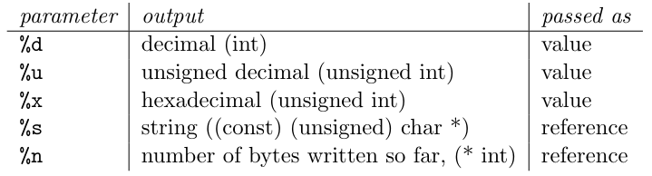

# [Pwn](https://en.wikipedia.org/wiki/Pwn)

> _"Segmentation fault"_ est une erreur que tous ceux qui ont déjà programmé en C ont certainement rencontrés. Le **segfault** signifie que <u>le programme a tenté d'accéder à une zone mémoire auquel il n'est pas censé avoir accès</u>.

L'objectif de ces notes est d'expliquer les failles de type **Buffer Overflow**, de passer en revue les différentes protections mises en œuvres au cours de ces dernières années _(NX bit, Stack Canary, ASLR...)_ ainsi que leurs contournements _(ret2libc, ROP etc.)_.

<!-- ## Un peu d'histoire

- 1988 - [**MORRIS** worm](http://ftp.cerias.purdue.edu/pub/doc/morris_worm/) 
- 1996 - [MUDGE - How to write Buffer Overflows](https://web.archive.org/web/19961109005654/http://www.l0pht.com/advisories/bufero.html)
- 1996 - Smashing the stack for fun and profit [web](http://phrack.org/issues/49/14.html) | [PDF](https://inst.eecs.berkeley.edu/~cs161/fa08/papers/stack_smashing.pdf)
... -->

## Sommaire

1. [Stack Buffer Overflow](#stack-buffer-overflow)
    + [NX bit & ret2libc](#)
    + [Canary (stack cookie) & bruteforce](#)
    + [ASLR](#)
2. [Format strings](#format-strings)
3. [Heap Buffer Overflow](#heap-buffer-overflow)
    + [Use After Free](#use-after-free)
4. [ROP: Return Oriented Programming](#rop-return-oriented-programming)
5. [Tips](#tips)
6. [Tools](#tools)
7. [Exercices](#exercices)
8. [Ressources](#ressources)

___

## Stack Buffer Overflow

### Définitions

- **Buffer**: zone mémoire _(de taille prédéfinie)_ servant à stocker des données. _Exemple: `argv` est un buffer qui sert à stocker les arguments passées au programme_.


- **Stack**: segment de la mémoire sur lequel s'empile des données locales aux fonctions _(variables, arguments)_ à <u>chaque nouvel appel</u>. _La stack grandit des adresses hautes vers les adresses basses._ 

Chaque nouvel appel de fonction créé une "zone de travail" appelée **_stackframe_**, délimitée par un pointeur vers le sommet de la _stack_ (**ESP**) et un pointeur vers le bas de la _stackframe_ (**EBP**).

> Sur une architecture 64 bits, **ESP** devient **RSP** et **EBP** devient **RBP**.

Pour que la fonction appelante puisse reprendre son cours d'exécution, on "**push**" **EIP** _(adresse de la prochaine instruction à exécuter)_ puis **EBP** sur la _stack_, enfin on créé la _stackframe_. ESP est alors écrasé avec la valeur d'EBP _(ils pointent vers la même case mémoire, la stackframe est donc vide)_. Ensuite, les variables locales à la fonction sont ajoutées une à une dans la stackframe courante. 

Enfin, durant l'exécution de la fonction appelée, on "**pop**" les valeurs de la stackframe une à une jusqu'à dépiler EBP et EIP pour continuer l'exécution de la fonction appelante. 

> Ceci afin qu'ESP et EBP repointent vers le haut et le bas de la stackframe précédente et qu'EIP pointe vers l'instruction suivant l'appel de fonction. 

<u>Résumé</u>:

1. `push eip`
2. `push ebp`
3. `mov ebp, esp` &rarr; _création de la stackframe (ESP = EBP)_
4. Push arguments de la fonction + variables locales <!-- Revoir l'ordre  -->
5. Pop arguments de la fonction + variables locales <!-- Revoir l'ordre  -->
6. `pop ebp`
7. `ret` _alias de `pop eip`_

**Exemple**:

```c
#include <string.h>

void f1(char *str)
{
    char buffer[8];
    strcpy(buffer, str);
}

void main(int argc, char *argv[])
{
    f1(argv[1]);
}
```


<u>**Question**</u>: Tout va bien si le buffer est inférieur à 8 octets mais que se passe-t-il s'il est supérieur ?

### Principe du _buffer overflow_

Quand un buffer est placé sur la pile, il grandit dans le sens inverse de la stack, c'est-à-dire qu'il grandit des adresses basses vers les adresses hautes. De ce fait, **il y a danger !** 

En effet, le buffer peut potentiellement réécrire le contenu des registres qui ont été push sur la stack _({r,e}bp, {r,e}ip)_ et par conséquent contrôler le flux d'exécution de notre programme _(en gros appeler les fonctions qu'il veut)_.

**Exemple**: Si on reprends le programme précédent, si le contenu du buffer ne fait pas 8 mais 16 octets _(ici 'A' * 16)_ alors **EIP est écrasé** et pointe désormais vers l'adresse **0x41414141** _(41 étant le code en hexadécimal du caractère 'A' dans la table ASCII)_.


<!--  -->

Nous sommes alors dans le cas d'un dépassement de tampon _(buffer overflow)_ et **on peut remplacer les 4 derniers octets du buffer par l'adresse que l'on souhaite** _(d'où le contrôle du flux d'execution)_. 

<!-- 
L'article SMASHSTACK decrit l'exploitation d'un buffer overflow en 3 parties:

1. GET EIP (recuperer le pointeur d'instruction)
2. Writing exploit (payload &rarr; shellcode par exemple)
3. Redirection


### NX bit ? ret2libc
### Stack Canary ? bypass
### ASLR ?

### PIC?
### PIE
 -->

___

## Format strings


___

## Heap Buffer Overflow

### Use after free
 
___

## ROP: Return Oriented Programming
___

## Tips

- Désactiver l'ASLR:
    + `echo 0 > /proc/sys/kernel/randomize_va_space`
- Compiler pour archi 32 bits en désactivant le Canari, le NX-Bit, ainsi que le PIE: 
    + `gcc -m32 -fno-stack-protector -z execstack -no-pie -g bof.c -o bof`

___

## Tools

- [python pwntools](https://docs.pwntools.com/en/stable/)
- [**ROPgadget**](https://github.com/JonathanSalwan/ROPgadget)
- [**Ropper**](https://github.com/sashs/Ropper)
- [xrop](https://github.com/acama/xrop)

## Exercices

- [Exploit exercises](https://exploit.education/)
- [ROP Emporium](https://ropemporium.com/)
- [microcorruption.com](https://microcorruption.com/)
- [**pwnadventure** - VIDEO Game](http://www.pwnadventure.com/) + [_setup server_](https://github.com/LiveOverflow/PwnAdventure3)

## Ressources

### Vidéos

- [**Louka Jacques-Chevallier** - 1, 2, 3 PWNED!](https://youtu.be/hmt8M9YLwTg?list=PL8xs7xVCig3z-HXt99t3ZDlaDF_kRbK19)
- [**Hackndo** - exploitation de binaires](https://www.youtube.com/watch?v=V7Gdc32XRhA&list=PL8mmTTrIt_anpC5jd8bCwTB5nLX7GFloq)
- [**François Boisson** - explication de "une faille de type bufferoverflow ..."_](https://youtu.be/u-OZQkv2ebw)
- [**LiveOverflow** - Binary Exploitation / Memory Corruption](https://www.youtube.com/playlist?list=PLhixgUqwRTjxglIswKp9mpkfPNfHkzyeN)
- [**0x41414141** youtube channel](https://www.youtube.com/channel/UCPqes566OZ3G_fjxL6BngRQ/playlists)
- [**nasm - RE** - pWn](https://www.youtube.com/playlist?list=PLcT0DaY68xGzD87AmjN4e9IuF4DfXUfsD)
- [**John Hammond** - Binary exploitation (CTF WU)](https://www.youtube.com/watch?v=yH8kzOkA_vw&list=PL1H1sBF1VAKVg451vJ-rx0y_ZuQMHPamH)

### Articles/Cours

- [**Hackndo** - Buffer overflow](https://beta.hackndo.com/buffer-overflow/)
- [**0x0ff.info** - Buffer Overflow & gdb – Part 1](https://www.0x0ff.info/2015/buffer-overflow-gdb-part1/)
- [**NagarroSecurity** - An interactive guide to buffer overflow](https://nagarrosecurity.com/blog/interactive-buffer-overflow-exploitation)
- [**Hackndo** - Technique du Canari : Bypass](https://beta.hackndo.com/technique-du-canari-bypass/)
- [**Hackndo** - ret2libc](https://beta.hackndo.com/retour-a-la-libc/)
- [**Hackndo** - ROP (Return Oriented Programming)](https://beta.hackndo.com/return-oriented-programming/)
- [**Geluchat** - Petit Manuel du ROP à l'usage des débutants](https://www.dailysecurity.fr/return_oriented_programming/)
- [LSE - Security Workshop](https://www.lse.epita.fr/teaching/epita/hts/workshop-secu.pdf)
- [ctf101 - buffer-overflow](https://ctf101.org/binary-exploitation/buffer-overflow/)
- [**xpn** - Exploiting with pwndbg - Solving PlaidCTF 2016 SmartStove](https://blog.xpnsec.com/pwndbg/)
- ["Exploiting Format String Vulnerabilities" paper](https://cs155.stanford.edu/papers/formatstring-1.2.pdf)
- [Les failles Format String](https://repo.zenk-security.com/Techniques%20d.attaques%20%20.%20%20Failles/Les%20failles%20Format%20String.pdf)