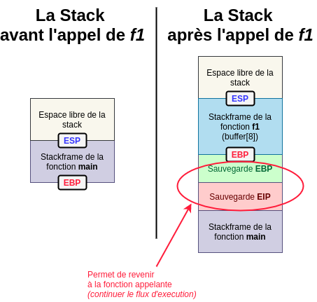

# Stack Buffer Overflow

L'objectif de ces notes est de passer en revue les différentes manières d'exploiter un **Buffer Overflow** ainsi que les protections mises en œuvres au cours de ces dernières années: _NX bit, canary, ASLR_ etc.

## Un peu d'histoire

- 1988 - [**MORRIS**](http://ftp.cerias.purdue.edu/pub/doc/morris_worm/) 
- 1996 - [Smashing the stack for fun and profit](#)
...

## Définitions

- **Buffer**: zone mémoire _(de taille prédéfinie)_ servant à stocker des données. _Exemple: `argv` est un buffer qui sert à stocker les arguments passées au programme_.


- **Stack**: segment de la mémoire sur lequel s'empile des données locales _(variables, arguments)_ à <u>chaque appel de fonction</u>. Chaque nouvel appel de fonction créé une "zone de travail" appelée **_stackframe_**, délimitée par un pointeur vers le sommet de la _stack_ (**ESP**) et un pointeur vers le bas de la _stackframe_ (**EBP**).

> Sur une architecture 64 bits, **ESP** devient **RSP** et **EBP** devient **RBP**.

Pour que la fonction appelante puisse reprendre son cours d'exécution, on "**push**" **EIP** _(adresse de la prochaine instruction à exécuter)_ puis **EBP** sur la _stack_, enfin on créé la _stackframe_. ESP est alors écrasé avec la valeur d'EBP _(ils pointent vers la même case mémoire, la stackframe est donc vide)_. Ensuite, les variables locales à la fonction sont ajoutées une à une dans la stackframe courante. Enfin, durant l'exécution de la fonction appelée, on "**pop**" les valeurs de la stackframe une à une jusqu'à dépiler EBP et EIP pour continuer l'exécution de la fonction appellante. 

> Ceci afin qu'ESP et EBP repointent vers le haut et le bas de la stackframe précédente et qu'EIP pointe vers l'instruction suivant l'appel de fonction. 

**Exemple**:

```c

```



## Principe du _buffer overflow_

