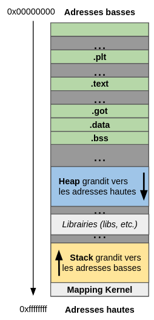
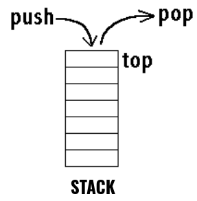
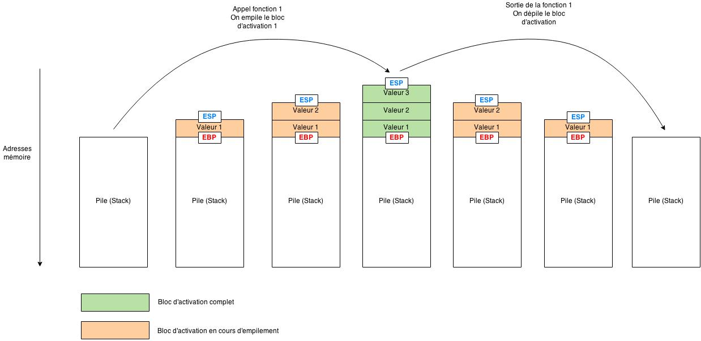
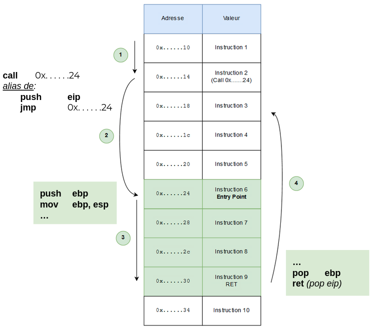
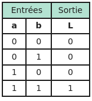
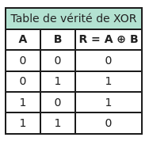

# Reverse

> **TODO**: _définir le **reverse**_

<u>Objectif</u>: comprendre la **gestion de la mémoire** lors de **l'exécution d'un programme**.

De nos jours, les systèmes d'exploitation que nous utilisons sont dits **multi-tâches** car il leur est possible d'exécuter plusieurs processus en parallèle.

Il faut savoir que lorsqu'un processus est exécuté, il ne manipule pas directement la mémoire physique de l'ordinateur.

En effet, les processus sont placés dans des **sandbox** _("bac à sable" en français)_ auxquelles sont affectées des adresses de **mémoire virtuelle** ~~_(2 * 32 -1 = 4 Go pour 32 bits)_~~.

Ceci permet au **kernel** _(noyau)_ de superviser l'accès à la mémoire physique de l'ordinateur et ainsi d'éviter les conflits de lecture/écriture.

> Ce méchanisme se fait par le biais de [_Page table_](https://en.wikipedia.org/wiki/Page_table). **Note**: Une partie de l'espace virtuel de chaque programme est réservée pour le mapping du kernel.

___

<!-- pagebreak -->

## Sommaire

1. [Segmentation de la mémoire](#segmentation-de-la-mémoire)
2. [Fonctionnement de la "Stack"](#fonctionnement-de-la-stack-pile)
3. [Un point sur les registres](#un-point-sur-les-registres)
4. [Architecture `x86`](#x86-architecture) _(32 bits)_
    + [Registres généraux du processeur **x86**](#registres-généraux-du-processeur-x86)
5. [Assembly (assembleur)](#assembly-assembleur)
    + [Syntaxes](#syntaxes)
        * [Intel](#intel)
        * [AT&T](#att)
        * [Différences notoires](#exemples-de-différences-notoires)
            - [Taille des paramètres](#taille-des-paramètres)
        * [Instructions communes](#instructions-communes)
            - [assignations](assignations)
            - [opérations](#opérations)
            - [manipulation de la stack](#manipulation-de-la-stack)
            - [contrôle de flux](#contrôle-de-flux-control-flow) _(control flow)_
            - [opérateurs de comparaisons](#comparaisons)
6. [`gdb`](#gdb)
    + [charger un binaire](#charger-un-binaire)
    + [choisir la syntaxe](#choisir-la-syntaxe)
    + [examiner la mémoire](#examiner-la-mémoire)
    + [breakpoints](#breakpoints)
    + [instruction par instruction](#instruction-par-instruction)
    + [effectuer des calculs](#effectuer-des-calculs)
    + [définir des fonctions](#définir-des-fonctions)
    + [`~/.gdbinit`](#gdbinit)
7. [Architecture `x86_64`](#x86_64-architecture) _(supporte 32 et 64 bits)_
8. [Architecture **ARM**](#arm)
10. [Tools](#tools)
    + [static](#static)
    + [dynamic](#dynamic)

___

<!-- pagebreak -->

## Segmentation de la mémoire

Segment              | Description
---------------------|--------------------------------------------------------------------------------------------------------------------------
**.text**             | segment de taille fixe, accessible en lecture seule, contient le "code" du programme _(instructions en langage machine)_. 
**.data**             | segment de taille fixe, accessible en lecture/écriture, contient les **variables globales initialisées**.
**.bss**              | segment de taille fixe, accessible en lecture/écriture, contient les **variables globales non initialisées**.
**heap** _("tas")_   | contient les **variables allouées dynamiquement** via les fonctions type `malloc`, `calloc` ou encore `realloc`.
**stack** _("pile")_ | zone de stockage temporaire contenant les **variables locales** ainsi que les **arguments des fonctions**. 

> Il existe d'autres segments _(tels que **.got** et **.plt** par exemple)_ qui ne sont pas décrits ici.

Ci-dessous un schéma récapitulatif de l'image d'un programme _(compilé)_ dans la mémoire:



Sur Linux, il est d'ailleurs possible de lister la taille des segments ainsi que la taille totale d'un fichier binaire via la commande `size`:

1. programme sans variable:
    ```c
    void main() {

    }
    ```
    + retour de la commande `size`:
        ```bash
        amir@os:~/examples$ gcc prog.c -o prog
        amir@os:~/examples$ size prog
        text	   data	    bss	    dec	    hex	filename
        1418	    544	      8	   1970	    7b2	prog        
        ```

2. programme avec variable globale initialisée:
    ```c
    int globalData = 42;
    void main() {
    }
    ```
    + retour de la commande `size`:
        ```bash
        amir@os:~/examples$ gcc prog.c -o prog
        amir@os:~/examples$ size prog
        text	   data	    bss	    dec	    hex	filename
        1418	    548	      4	   1970	    7b2	prog
        ```
> On constate que par rapport au test n°**1**, le segment _data_ passe de 544 à 548 _(soit 4 octets la taille d'un `int`)_. La taille du segment _text_ ne change pas, car ce dernier ne stocke pas les variables. _Bizaremment le segment bss diminue..._ :hushed:

3. Si on ajoute maintenant un variable globale non initialisée: 
    ```c
    int globalData = 42;
    int globalBss;
    void main() {
    }
    ```
    + retour de la commande `size`:
        ```bash
        amir@os:~/examples$ gcc prog.c -o prog
        amir@os:~/examples$ size prog
        text	   data	    bss	    dec	    hex	filename
        1418	    548	     12	   1978	    7ba	prog
        ```
> On observe que la taille du segment _bss_ a effectivement augmentée.

## Fonctionnement de la "Stack" _(pile)_

La Stack est dite "**LIFO**" _(**L**ast **I**n **F**irst **O**ut)_ ou "**FILO**" _(**F**irst **I**n **L**ast **O**ut)_. Deux opérations sont possibles:

1. **`push`** qui consiste à placer un élément au dessus de la pile _(empiler)_.
2. **`pop`** pour retirer l'élément au dessus de la pile _(dépiler)_.

> _Imaginer une pile d'assiettes._



>  La **_stack frame_** (ou le _bloc d'activation_) d'une fonction est une zone mémoire dans la Stack pour laquelle sont enregistrées toutes les informations nécessaires à l'appel de cette fonction (variables locales notamment).

> Concernant le tas _(**heap**)_, lire [fonctionnement de la heap](http://inf0sec.fr/article-11.php).

## Un point sur les registres

_Les registres sont des emplacements mémoire qui sont à l'intérieur du processeur._ Ils se situent au sommet de la <u>hiérarchie mémoire</u> _(voir figure ci-dessous)_ et constituent la mémoire la plus rapidement accessible par le processeur. Pour un ordre d'idée:


> Ici les tailles des registres et autres caches ne sont données qu'à titre indicatif.

> La taille qu'un registre occupe en mémoire dépend du type de processeur. x86 &rarr; 32 bits | x86_64 &rarr; 64 bits

## x86 Architecture 

### Registres généraux du processeur x86

Registre  | Description
----------|-------------------
`EAX`     | **A**ccumulateur stocke le code de retour des fonctions (_+ des valeurs en général_)
`ECX`     | **C**ompteur que l'on incrémente _(dans les boucles `for` par exemple)_
`EDX`     | **D**onnées pour les opérations d'entrées/sorties
`EBX`     | **B**ase &rarr; pointeur de données
`ESI`     | **I**ndex de **S**ource
`EDI`     | **I**ndex de **D**estination
`EFLAGS`  | Drapeaux pour les tests _(comparaison etc.)_
**`EIP`** | Pointeur d'**I**nstruction (adresse de l'instruction que le processeur doit exécuter)
**`EBP`** | Pointeur de **B**ase "censé" pointé vers le bas de la Stack _(en réalité &rarr;  début de la stackframe)_
**`ESP`** | Pointeur vers le haut de la **S**tack (évolue constamment)

_La stack frame courante (bloc d'activation) est délimitée par les adresses contenues dans `EBP` et `ESP`:_



**Comment le processeur revient-il à l'état précédent ?**

> **Rappel**: chaque fonction a sa propre _stack frame_.

Pour chaque fonction, le compilateur génère:

- un **prologue** qui <u>sauvegarde les informations de la fonction appelante</u> et <u>réserve de l'espace sur la stack pour les besoins de la fonction</u> _(variables locales etc.)_.

> Avant l'appel d'une fonction, les arguments puis le registre `EIP` sont placés sur la stack. Ensuite, c'est au tour d'`EBP` d'être **push**. Enfin, `ESP` est écrasé avec la valeur d'`EBP` afin de créer la _stack frame_ de la fonction appelé.

```nasm
push   ebp
mov    ebp,esp
...
```

- et un **épilogue** qui s'occupe de <u>restituer ces informations sauvegardées pour que la fonction appelante puisse reprendre son cours d'exécution</u>.

> Lorsqu'on <u>désassemble</u> une fonction _(avec `gdb` ou `objdump` par exemple)_, les deux dernières instructions sont `pop ebp` et `ret`. `pop ebp` permet de placer `EBP` sur le début de la _stack frame_ de la fonction appelante. `ret` revient à `pop eip` _(qu'on avait **push** au début lors de l'appel à la fonction)_ pour placer `EIP` à l'instruction qui se trouve après l'appel de la fonction.

```nasm
pop ebp
ret
```

Pour résumer:



_L'instruction assembleur (`call`) pour appeler une fonction  équivaut à placer `EIP` sur la stack et se rendre à l'adresse de la fonction:_

```nasm
push EIP
jmp <adresse de la fonction>
```

> `push`, `pop`, `call` et `jmp` sont des intructions assembleur que nous allons voir dans la partie suivante. 

## Assembly _(assembleur)_

**L'assembleur est le langage du processeur.** Il est compose d'**instructions** dont la structure commune est généralement la suivante:

```
OPERATION [ARG1 [, ARG2]]
```

> _Contrairement à ce qu'on pourrait penser, <u>il n'existe pas un seul langage assembleur</u>! Dans la mesure où il existe plusieurs architectures de processeur qui possèdent chacune d'entres elles des instructions différentes en langage machine, chaque architecture possède son propre langage assembleur_.

### Syntaxes

Ci-dessous nous désassemblons _(c'est-à-dire qu'on réduit au code assembleur)_ la même fonction mais dans **deux syntaxes différentes**:

1. **intel**:

    ```bash
    gdb-peda$ set disassembly intel
    gdb-peda$ disass main
    Dump of assembler code for function main:
    0x000011a5 <+0>:	push   ebp
    0x000011a6 <+1>:	mov    ebp,esp
    0x000011a8 <+3>:	sub    esp,0x10
    0x000011ab <+6>:	call   0x11cd <__x86.get_pc_thunk.ax>
    0x000011b0 <+11>:	add    eax,0x2e50
    0x000011b5 <+16>:	push   0x2a
    0x000011b7 <+18>:	push   0x8
    0x000011b9 <+20>:	push   0x4
    0x000011bb <+22>:	call   0x1189 <reponse>
    0x000011c0 <+27>:	add    esp,0xc
    0x000011c3 <+30>:	mov    DWORD PTR [ebp-0x4],eax
    0x000011c6 <+33>:	mov    eax,0x0
    0x000011cb <+38>:	leave  
    0x000011cc <+39>:	ret    
    End of assembler dump.
    ```
2. **at&t**:

    ```bash
    gdb-peda$ set disassembly att
    gdb-peda$ disass main
    Dump of assembler code for function main:
    0x000011a5 <+0>:	push   %ebp
    0x000011a6 <+1>:	mov    %esp,%ebp
    0x000011a8 <+3>:	sub    $0x10,%esp
    0x000011ab <+6>:	call   0x11cd <__x86.get_pc_thunk.ax>
    0x000011b0 <+11>:	add    $0x2e50,%eax
    0x000011b5 <+16>:	push   $0x2a
    0x000011b7 <+18>:	push   $0x8
    0x000011b9 <+20>:	push   $0x4
    0x000011bb <+22>:	call   0x1189 <reponse>
    0x000011c0 <+27>:	add    $0xc,%esp
    0x000011c3 <+30>:	mov    %eax,-0x4(%ebp)
    0x000011c6 <+33>:	mov    $0x0,%eax
    0x000011cb <+38>:	leave  
    0x000011cc <+39>:	ret    
    End of assembler dump. 
    ```

#### INTEL

La syntaxe **intel** a la **réputation d'être plus simple à lire et à comprendre**.

- Structure d'une instruction assembleur avec la synatxe **at&t**:
    ```
    OPERATION <destination> <source> 
    ```
    + Exemple: insérer la valeur `42` dans le registre **`EAX`**
        ```nasm
        mov eax, 42 
        ```

> _**Note**: le `<destination> <source>` est semblable au langage de programmation de plus haut niveau._

#### AT&T

La syntaxe **at&t** est celle qui est **utilisée par défaut sur les outils de désassemblage sur Linux** _(`objdump` etc.)_.

- Structure d'une instruction assembleur avec la synatxe **at&t**:
    ```
    OPERATION <source> <destination> 
    ```
    + Exemple: insérer la valeur `42` dans le registre **`EAX`**
        ```nasm
        mov $42, %eax 
        ```

**Particularité** de la syntaxe: 
- `%` devant le nom des **registres**.
- et `$` en préfixe des **valeurs**.

#### Exemples de différences notoires

**Par conséquent, il est possible d'écrire une même instruction de plusieurs façons différentes!**

**INTEL**    | **AT&T**
-------------|----------
`mov eax, 1` | `mov $1, %eax`

##### Taille des paramètres

En assembleur, il est possible de **manipuler qu'une partie d'un registre**.

###### at&t

Pour **AT&T**, la taille doit etre spécifiée en suffixe de l'instruction selon les lettres suivantes:

- **`l`**: _(long, double word)_ 32 premiers bits.
- **`w`**: _(word)_ 16 premiers bits.
- **`b`**: _(byte)_ 8 premiers bits (de 0 à 7).
- **`s`**: _(short)_ bits 7 à 15. 

> **`q`**: 64 premiers bits du registre.

###### intel

En **INTEL**, un registre est divisible en sous parties.

- **`EAX`**: _(long, double word)_ 32 premiers bits du registre .
- **`AX`**: _(word)_ 16 premiers bits.
- **`AL`**: _(byte)_ 8 premiers bits (de 0 à 7).
- **`AH`**: _(short)_ bits 7 à 15. 

>  **`RAX`** (64 bits &rarr; _qword_) également (voir [x86_64 Architecture](#x86-64-architecture)).

De ce fait, pour <u>déplacer la valeur 5 vers les 8 premiers bits du registre **`EAX`**</u>, on utilise `al` en **intel** et `b` en **at&t**:

**INTEL**    | **AT&T**
-------------|----------
|`mov al, 5` | `movb $5, %eax`

> EN **INTEL**, lorsqu'on souhaite manipuler une adresse et non un registre, la syntaxe suivante est utilisé: `mov DWORD PTR [addresse], 5`. `DWORD` pour **double word (32 bits)**. 

#### Instructions communes

> _Nous avons déjà vu `push`, `pop`, `mov`, `jmp` et `call`_.

#####  Assignations

- `mov <address1>, <address2>`: place le contenu de la source _(**valeur**)_ vers l'adresse de destination _(le sens dépend de la syntaxe)_. 

> `mov` <u>**copie** mais ne déplace pas le contenu!</u>

- `lea <address>, [address]`: assigne l'**adresse** d'une variable à une variable.

> [What is the difference between MOV and LEA?](https://stackoverflow.com/questions/1699748/what-is-the-difference-between-mov-and-lea) `mov`: value &rarr; address | `lea`: address &rarr; address.

##### Opérations

- `add <value1>, <value2>`: additionne une valeur à une autre.
- `sub <value1>, <value2>`: soustrait une valeur à une autre.

- `and <value1>, <value2>`: performe un **ET logique**.



- `xor <value1>, <value2>`: effectue un **OU exclusif**.



##### Manipulation de la stack

- `push <item>`: place l'élément au **sommet** de la pile.
- `pop <item>`: retire l'élément au sommet de la pile ete remets **`ESP`** à la valeur au sommet sur la pile.

> **Rappel**: le registre `ESP` pointe systématiquement vers le haut de la pile. 

##### Contrôle de flux _(Control flow)_

- `jmp <address>`: saut inconditionnel. _Similaire à_ `mov eip,<address>`.
- `call <address>`: appel de fonction située à un espace mémoire différent. Alias de:

```nasm
push EIP ; sauvegarder l'instruction qui suit le call pour reprendre le fil d'exécution du programme
jmp <adresse de la fonction> ; sauter à la fonction recherchée
```

- `leave`: détruit ce qu'il reste de la _stackframe_ courante. Alias de:

```nasm
mov ESP, EBP
pop EBP
```

- `ret`: récupère l'adresse de l'instruction à exécuter après le `call`, la place dans **`EIP`** et saute à cette adresse. Alias de:

```nasm
pop EIP
```

- `nop`: no operation.

##### Comparaisons

- `cmp <value1>, <value2>`: compare une valeur à une autre en effectuant une soustraction signée.
    + `test <value>, <value>`: permet de savoir si <value> est positif ou non via un `AND` _(plus rapide que la soustraction de `cmp`)_.
- `je <address>`: _Si **égal** alors va à cette adresse_.
- `jne <address>`: _Si **non égal** alors va à cette adresse_.
- `jz <address>`: _Si **nul** alors va à cette adresse_.
- `jnz <address>`: _Si **non nul** alors va à cette adresse_.
- `jg <address>`: _(signé)_ supérieur strict (Greater).
- `jl <address>`: _(signé)_ inférieur strict (Lower).
- `ja <address>`: _(**non** signé)_ supérieur strict (Above).
- `jb <address>`: _(**non** signé)_ inférieur strict (Below).
- `jae <address>`: _(**non** signé)_ supérieur ou égal.
- `jbe <address>`: _(**non** signé)_ inférieur ou égal.

___

## `(gdb)`

Avant de décrire l'architecture **ARM** et des différences entre l'architecture **x86** et **x86_64**, il est important d'introduire l'outil **GDB** (GNU Debugger).

**GDB** peut servir à:
- désassembler un programme.
- manipuler le flow d'exécution d'un programme:
    + placer des _**breakpoints**_
    + sauter des instructions
    + les exécuter une à une
    + modifier le contenu des registres/ de la RAM.
- _et par extension <u>faire du reverse engineering</u>_.

```bash
$ gdb
(gdb) help
List of classes of commands:

aliases -- Aliases of other commands
breakpoints -- Making program stop at certain points
data -- Examining data
files -- Specifying and examining files
internals -- Maintenance commands
obscure -- Obscure features
running -- Running the program
stack -- Examining the stack
status -- Status inquiries
support -- Support facilities 
tracepoints -- Tracing of program execution without stopping the program
user-defined -- User-defined commands

Type "help" followed by a class name for a list of commands in that class.
Type "help all" for the list of all commands.
Type "help" followed by command name for full documentation.
Type "apropos word" to search for commands related to "word".
Command name abbreviations are allowed if unambiguous.
(gdb)
```

> **TODO**: _Parler des **symbols**_

### charger un binaire

#### hors `(gdb)`

```bash
# Charge le binaire "binary" dans gdb
gdb binary

# Charge le binaire "binary" dans gdb en mode "quiet" (i.e. sans afficher  les messages d'introduction et de copyright)
gdb -q binary

# Charge le binaire "binary" avec les arguments "args..."
gdb --args <binary> <args...>

# Lance gdb qui s'attache par la suite au processus PID avec les symboles du binaire "binary"
gdb --pid <PID> --symbols <binary>
```

#### une fois dans `(gdb)`

```bash
# Envoyer les arguments au binaire qui va être lancé
(gdb) set args <args...>

# Lancer le binaire
(gdb) run # ou simplement 'r'(alias)

# Lancer le binaire directement avec des arguments
(gdb) run <args...>
# ou alors ...
(gdb) r $(python -c 'print("A" * 42)')

# Lancer le binaire, et lui envoyer un flux dans stdin
(gdb) r < <(python -c 'print("A" * 42)')

# Tuer le binaire en cours
(gdb) kill

# Quitter gdb
(gdb) quit
```

### choisir la syntaxe

```bash
# choisir la syntaxe intel
(gdb) set disassembly intel # certains écrivent 'set disassembly-flavor intel'
(gdb) disass main # alias de 'disassembly main'
Dump of assembler code for function main:
   0x000000000000114d <+4>:	push   ebp
   0x000000000000114e <+5>:	mov    ebp,esp
...
# choisir la syntaxe at&t
(gdb) set disassembly att
(gdb) disass main 
Dump of assembler code for function main:
   0x000000000000114d <+4>:	push   %ebp
   0x000000000000114e <+5>:	mov    %ebp,%esp
...
```

### examiner la mémoire

```bash
# vérifier le contenu des registres
(gdb) i r # info registers

# vérifier le contenu d'un registre en particulier (exemple: EAX)
(gdb) i r eax # info register eax
eax            0x555555555149      93824992235849

# afficher le contenu d'un registre
(gdb) print $eax
$1 = 93824992235849
# ou alors ...
(gdb) p $eax

#info breakpoints : Permet de lister les breakpoints et leurs états
(gdb) i b

# afficher le contenu de la stack
(gdb) bt
# afficher le contenu complet de la stackframe (variables locales etc.)
(gdb) bt full
```

L'intruction `x` mérite qu'on s'attarde un peu plus sur elle:

```bash
(gdb) help x
Examine memory: x/FMT ADDRESS.
ADDRESS is an expression for the memory address to examine.
FMT is a repeat count followed by a format letter and a size letter.
Format letters are o(octal), x(hex), d(decimal), u(unsigned decimal),
  t(binary), f(float), a(address), i(instruction), c(char), s(string)
  and z(hex, zero padded on the left).
Size letters are b(byte), h(halfword), w(word), g(giant, 8 bytes).
The specified number of objects of the specified size are printed
according to the format.  If a negative number is specified, memory is
examined backward from the address.

Defaults for format and size letters are those previously used.
Default count is 1.  Default address is following last thing printed
with this command or "print".
(gdb)
```

En d'autres termes, `x/<N><F><S> ADDRESS` permet d'examiner la mémoire à une adresse précise. L'affichage varie selon les options suivantes:

- **`N`** _(nombre d'unités à afficher)_: nombre.
- **`F`** _(format de l'affichage)_:
    + `o` _(octal)_
    + `x` _(hex)_
    + `d` _(decimal)_
    + `u` _(unsigned decimal)_
    + `t` _(binary)_
    + `f` _(float)_
    + `a` _(address)_
    + **`i`** _(instruction)_
    + `c` _(char)_
    + `s` _(string)_
    + `z` _(hex, zero padded on the left)_
- **`S`** _(size &rarr; taille )_:
    + `b` _(byte)_  1 octet. 
    + `h` _(halfword)_ 2 octets.
    + `w` _(word)_ 4 octets.
    + `g` _(giant, 8 bytes)_  2 _words_, 8 octets.

> Sur un processeur `x86`, les valeurs sont stockées dans l'_orientation **little-endian**_ (poids faible &rarr; poids fort). 

```bash
# afficher le code assembleur au dessus de nos commandes gdb
(gdb) layout asm
# afficher l'état des registres au dessus de nos commandes gdb
(gdb) layout regs
# Si un registre change lorsqu'on avance d'une instruction, il est mis en surbrillance.
```

> **Note**: Si on utilise ces fenêtres, on ne sera plus en mesure d’utiliser la flèche du haut pour revenir dans notre historique, puisque les flèches haut et bas servent à monter et descendre dans la fenêtre affichant le code assembleur.

### breakpoints

> _Les **breakpoints** permettent d'étudier la mémoire <u>à un instant très précis</u>._

#### sans conditions

```bash
(gdb) b main # break main
Breakpoint 1 at 0x80483f8

(gdb) b *0x08048400 # break at a specific address
Breakpoint 2 at 0x8048400

(gdb) delete 1 # delete le n-ième breakpoint (ici le premier)
(gdb) i b
Num     Type           Disp Enb Address    What
2       breakpoint     keep y   0x08048400 <main+14>

(gdb) disable 2 # désactiver le n-ième breakpoint (ici le second)
(gdb) enable 2 # activer le n-ième breakpoint (ici le second)
(gdb) i b
Num     Type           Disp Enb Address    What
2       breakpoint     keep n   0x08048400 <main+14>

(gdb) delete breakpoints # supprimer les breakpoints
Delete all breakpoints? (y or n) y
```

#### avec conditions

Imaginons que nous débuggons l'exécution d'une boucle `for (i= ; ...; i++)` par exemple. Il est probable que l'on souhaite placer un breakpoint à une certaine valeur de _i_. Exemple:

```bash
(gdb) b *<address> if *(int*)($esp+0x1c) == 0xa

# aurait pu être fait également de la manière suivante
(gdb) b *0x08048430
Breakpoint 1 at 0x8048430
(gdb) cond 1 *(int*)($esp+0x1c) == 0xa

# enlever les conditions sur un breakpoint :
(gdb) cond 1
Breakpoint 1 now unconditional.
```

### instruction par instruction

```bash
# nexti: avance d'une instruction, et si c'est un call, le call est exécuté jusqu'à son retour.
(gdb) ni 

# stepi: avance d'une step instruction, en rentrant dans les calls 
(gdb) si 

(gdb) c # continue: avance jusqu'au prochain breakpoint
```

> [_What's the difference between `nexti` and `stepi` in `gdb`?_](https://stackoverflow.com/questions/52024529/whats-the-difference-between-nexti-and-stepi-in-gdb)

### effectuer des calculs

```bash
# On peut afficher les variables sous différents formats, de la manière suivante : p/<format>
# Les formats les plus employés sont
# c    Char
# f    Float
# o    Octal
# s    String
# t    Binary
# x    Hexadecimal

(gdb) p 10+12
$1 = 22
(gdb) p/x 10+12
$2 = 0x16
(gdb) p 0x10
$3 = 16
(gdb) p 0x10 + 10
$4 = 26
(gdb) p/x 0x10 + 10
$5 = 0x1a
(gdb) p/t 12
$6 = 1100
```

### définir des fonctions

Pour éviter de relancer un même ensemble de commandes, il est possible de définir des fonctions. Exemple:

```bash
(gdb)  define init_mes_params
Type commands for definition of "init_mes_params".
End with a line saying just "end".
>set disassembly-flavor intel
>break main
>r
>i r
>x/24xw $esp
>end
(gdb) init_mes_params
Breakpoint 1 at 0x804840f

Breakpoint 1, 0x0804840f in main ()
eax            0xbffff454    -1073744812
ecx            0xe97a4d24    -377860828
edx            0x1    1
ebx            0xb7fcfff4    -1208156172
esp            0xbffff3a8    0xbffff3a8
ebp            0xbffff3a8    0xbffff3a8
esi            0x0    0
edi            0x0    0
eip            0x804840f    0x804840f <main+3>
eflags         0x246    [ PF ZF IF ]
cs             0x23    35
ss             0x2b    43
ds             0x2b    43
es             0x2b    43
fs             0x0    0
gs             0x63    99
0xbffff3a8:    0xbffff428    0xb7e85e46    0x00000001    0xbffff454
0xbffff3b8:    0xbffff45c    0xb7fd4000    0x08048320    0xffffffff
0xbffff3c8:    0xb7ffeff4    0x08048252    0x00000001    0xbffff410
0xbffff3d8:    0xb7ff06d6    0xb7fffad0    0xb7fd42e8    0xb7fcfff4
0xbffff3e8:    0x00000000    0x00000000    0xbffff428    0xc6213b34
0xbffff3f8:    0xe97a4d24    0x00000000    0x00000000    0x00000000
```

Évidemment, il est possible d'ajouter des conditions:

```bash
> if <condition>
>     commandes...
> end
> while <condition>
>     commandes...
> end
```

### `~/.gdbinit`

```bash
$ cat ~/.gdbinit
# Pour toujours avoir la syntaxe intel
set disassembly intel

# Pour que lors d'un fork, gdb suive le processus enfant, plutôt que le processus parent
set follow-fork-mode child

# Si vous savez que vous devez lancer gdb plusieurs fois pour le binaire que
# vous êtes en train de débuguer, et que les 9 première itérations d'une boucle
# ne vous importent pas, autant breaker tout de suite au moment qui vous intéresse
b *0x8048705 if *(int*)($esp+0x10) == 0xa

# Et lancer le binaire
r

# Ensuite, nous voulons souvent utiliser ces deux fonctions en même temps
# Autant les regrouper dans une même fonction !
define afficher_layouts
layout asm
layout regs
end
$ gdb <binary> -nx # lancer gdb sans utiliser ~/.gdbinit
```

> _Voir [gdb - PEDA](https://github.com/longld/peda) pour aller plus loin._

___

## x86_64 Architecture

|**32** bits|**64** bits|
|-----------|-----------|
| **`EAX`** | **`RAX`** |
| **`EDX`** | **`RDX`** |
| **`EBX`** | **`RBX`** |
| **`ECX`** | **`RCX`** |
| **`ESI`** | **`RSI`** |
| **`EDI`** | **`RDI`** |
| **`ESP`** | **`RSP`** |
| **`EBP`** | **`RBP`** |
| **`EIP`** | **`RIP`** |

___

## Architecture ARM
___

## Tools

> [Which RE tool should I choose?](https://www.reddit.com/r/securityCTF/comments/curt1f/which_re_tool_should_i_choose_radare_vs_ghidra/) _You can NEVER have too many tools in your tool belt. You'll also find over time that certain tools do certain things better sometimes._

### Static

- [**IDA**](https://www.hex-rays.com/products/ida/)
- [**Ghidra**](https://ghidra-sre.org/)
- [**Radare2**/**cutter**](https://www.radare.org/n/)
- [**Binary Ninja**](https://binary.ninja/)
- [**Hopper**](https://www.hopperapp.com/)
- [**x64dbg**](https://x64dbg.com/)
- [**OllyDbg**](http://www.ollydbg.de/)
- [**WinDBG**](http://www.windbg.org/)


### Dynamic

- [**arm_now**](https://github.com/nongiach/arm_now)
- [PEDA](https://github.com/longld/peda) _(`gdb` plugin)_

## Ressources

- [**Hackndo** - Gestion de la mémoire](https://beta.hackndo.com/memory-allocation/)
- [**Hackndo** - Fonctionnement de la pile](https://beta.hackndo.com/stack-introduction/)
- [**Hackndo** - Assembleur _(notions de base)_](https://beta.hackndo.com/assembly-basics/)
- [**Hackndo** - Introduction à gdb](https://beta.hackndo.com/introduction-a-gdb/)
- [**Hackndo** - Fonctionnement de la pile](https://beta.hackndo.com/stack-introduction/)


- [**N0fix** - Reverse engineering et exploitation de binaires](https://github.com/N0fix/reverseIntro#veille-cyberd%C3%A9fense---victorien-blanchard)
- [**Microsoft** - RAM, mémoire virtuelle, fichier d'échange et gestion de la mémoire dans Windows](https://support.microsoft.com/fr-fr/help/2160852/ram-virtual-memory-pagefile-and-memory-management-in-windows)
- [**stackoverflow** - what is kernel mapping in linux?](https://stackoverflow.com/questions/53301388/what-is-kernel-mapping-in-linux)
- [**aldeid** Wiki - x86-assembly](https://www.aldeid.com/wiki/Category:Architecture/x86-assembly)
- [**Intel** - Advanced Computer Concepts for the (Not So) Common Chef: Memory Hierarchy: Of Registers, Cache & Memory](https://software.intel.com/en-us/blogs/2015/06/11/advanced-computer-concepts-for-the-not-so-common-chef-memory-hierarchy-of-registers)

- [GDB - Managing inputs for payload injection?](https://reverseengineering.stackexchange.com/questions/13928/managing-inputs-for-payload-injection)

- [**Ophir Harpaz** - Reverse Engineering for Beginners](https://www.begin.re/)

- [Reversing the VKSI2000 Hand-Held Trading Device by **FOX PORT** ](https://sockpuppet.org/issue-79-file-0xb-foxport-hht-hacking.txt.html)

- [**Sébastien Mériot** - Introduction à l'analyse des malwares](https://www.youtube.com/watch?v=hUdSp-kz_xI)
- [**HackerSploit** - Malware Analysis](https://www.youtube.com/playlist?list=PLBf0hzazHTGMSlOI2HZGc08ePwut6A2Io)
- [RTFM SigSegv1 - Analyse du Malware TinyNuke](https://youtu.be/K44tl9NMop0)
