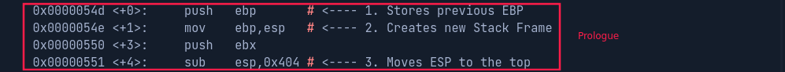

Les registres généraux peuvent être divisées en:
- Registres de **données**
- Registres d'**index**
- Registres de **pointeur**

## Registres de données

Registre 32-bit | Registre 64-bit | Description
----------------|-----------------|------------
`EAX`           | `RAX`           | **A**ccumulateur est utilisé en entrée / sortie et pour les opérations arithmétiques
`EBX`           | `RBX`           | **B**ase &rarr; pointeur de données
`ECX`           | `RCX`           | **C**ompteur qui s'incrémente 
`EDX`           | `RDX`           | **D**onnées pour les opérations d'entrées/sorties

## Registres d'index

Registre 32-bit | Registre 64-bit | Description
----------------|-----------------|------------
`ESI`           | `RSI`           | Index de source utilisé comme pointeur pour les opérations sur les chaînes de caractères
`EDI`           | `RDI`           | Index de destination utilisé comme pointeur pour les opérations sur les chaînes de caractères

## Registres de pointeur

Registre 32-bit | Registre 64-bit | Description
----------------|-----------------|------------
`EIP`           | `RIP`           | Pointeur d'Instruction stocke l'adresse de la prochaine instruction à être exécutée
`ESP`           | `RSP`           | Stack Pointeur vers le haut de la Stack
`EBP`           | `RBP`           | Base Pointeur vers le bas de la Stack

___

