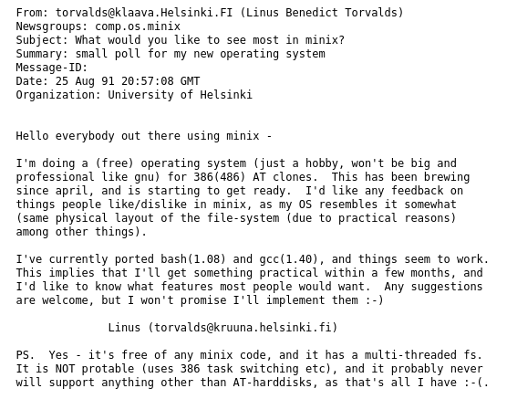
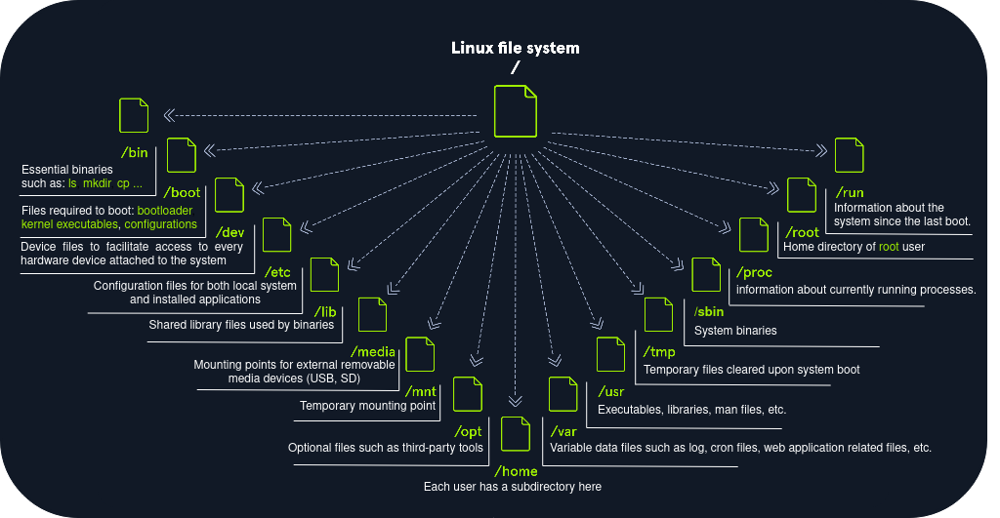
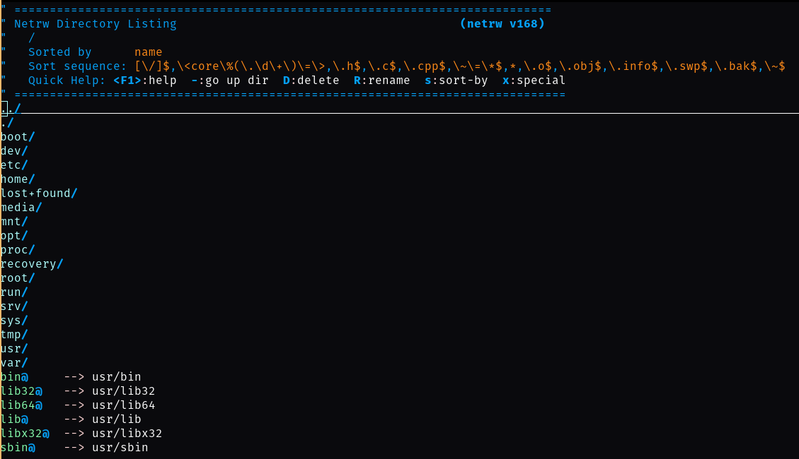

# Linux

**Linux** is an operating system (OS) just like [Windows](https://github.com/amirr0r/notes/tree/master/Windows#windows) or **macOS**. 

> An OS is a software that manages the whole communication between software and hardware.

Linux is **free** and **open-source**, the source code can be modified and distributed commercially or non-commercially by anyone.

> Open source software are not necessarily free!  

1. [A bit of history...](#a-bit-of-history)
2. [Distros (distributions)](#distros-distributions)
3. [Filesystem Hierarchy Standard (FHS)](filesystem-hierarchy-standard-fhs)
4. [Philosophy](#philosophy)
5. [Components](#components)
6. [Useful commands](#useful-commands)
7. [Security](#security)

[Useful links](#useful-links)

___

## A bit of history...

- **1970**: The history of Linux operating system (OS) began with the **Unix** operating system released by **Ken Thompson** and **Dennis Ritchie**, both of whom worked for **AT&T** at the **Bell Labs** research center at the time.

> Unix stand for Uniplexed Information and Computing Service. 

> Originally written in assembly language, but in 1973, Version 4 Unix was rewritten in C.

- **1977**: Berkeley Software Distribution (**BSD**) was released. Due to a lawsuit, against the University of California and Berkeley since BSD contained portions of Unix code owned by AT&T, the development of BSD encountered some issues.

- **1983**: **Richard Stallman**, from the **MIT**, started the **GNU** project. The goal was to propose a free and open source Unix-like operating system. Part of his work resulted in the creation of the `GNU General Public License` (GPL) a free software license.

- **1991**: The GNU kernel called Hurd, which unfortunately never came to completion. **Linus Torvalds**, a Finnish student, developed a new, free operating system kernel called **Linux** (initially just for a personal project).

> The kernel is the most important piece in the operating system. It allows the hardware to talk to the software.

These two projects were complementary: while Richard Stallman created the basic programs (`cp`,` rm`, `emacs`, etc), Linus had developed on the creation of the core of an operating system: the kernel.

The GNU Project (free programs) and Linux (OS kernel) merged to create **GNU/Linux**.



> Linux was inspired by `Minix` which was inspired by `Unix` was inspired by `Multics`.

Linux kernel has gone from a small number of files written in C under licensing that prohibited commercial distribution to  [27.8 million source lines of code](https://www.linux.com/news/linux-in-2020-27-8-million-lines-of-code-in-the-kernel-1-3-million-in-systemd/) (for the latest version), licensed under the GNU General Public License v2.

Nowadays, Linux-based operating systems are installed on:
- servers
- desktops 
- mainframes
- embedded systems (routers, televisions, video game consoles, etc). 

**Android** which runs on 85% of smartphones and tablets is also based on the Linux kernel. 

Considering all these facts, Linux is, with no doubt, the most widely installed operating system!

> macOS ("OS X") is a Unix like operating system.

> The latest version of Windows supports Linux containers and [Windows Subsystem for Linux (WSL)](https://docs.microsoft.com/fr-fr/windows/wsl/).
___

## Distros (distributions)

A Linux distribution consists in an operating system based on the Linux kernel and supporting softwares and libraries.

There are many different distributions (distros). 

> A bit like a version of Windows.

**Debian**, **Ubuntu**, **Fedora**, **RedHat**, **Kali Linux**, **Arch Linux**, **Manjaro** and **Gentoo** are the most famous distros.

```
Linux
├── Debian
│   ├── Ubuntu
│   │  ├── Mint
│   ├── Kali Linux
├── openSUSE
├── Fedora
│   ├── Red Hat
│   │   ├── CentOS
├── Arch Linux
│   ├── Manjaro
│   ├── BlackArch
├── Gentoo
```

___

## Filesystem Hierarchy Standard (FHS)



___

## Philosophy

- Everything is a file.

_Even directories_:



- Designed to **work mainly with the terminal**, which gives greater control over the operating system. (Example: creating 100 files with a command line vs. creating 100 files with the GUI)

- Small, single-purpose programs which can be chained to perform complex tasks. 

___

## Components

Besides, the OS kernel, the Bootloader _(such as GRUB)_ and the shell (command line), Linux differs from other OS mainly due to these components:

- `Graphical server`: provides a graphical sub-system (server) called "`X`" or "`X-server`" that allows graphical programs to run locally or remotely on the X-windowing system.
- `Window Manager` such as `i3wm`, `GNOME`, `Xfce`, `Unity`, and `KDE`. 
- `Package Manager` such as `apt`, `yum`, `pacman`.

> Packages are archives that contain binaries of software, configuration files, information about dependencies and keep track of updates and upgrades. 

> `apt` uses a database called the `apt` cache. This is used to provide information about packages installed on our system offline via `apt-cache search|show <keyword>`.

> Most Linux distributions have now switched to `systemd`. This daemon is an Init process started first and thus has the process ID (PID) 1. This daemon monitors and takes care of the orderly starting and stopping of other services. 

___

## Useful commands

| **Command** | **Description** |
| --------------|-------------------|
| `man <tool>` | Opens man pages for the specified tool. | 
| `<tool> -h` | Prints the help page of the tool. | 
| `apropos <keyword>` | Searches through man pages' descriptions for instances of a given keyword. | 
| `cat` | Concatenate and print files. |
| `whoami` | Displays current username. | 
| `id` | Returns users identity. | 
| `hostname` | Sets or prints the name of the current host system. | 
| `uname` | Prints operating system name. | 
| `pwd` | Returns working directory name. | 
| `ifconfig` | The `ifconfig` utility is used to assign or view an address to a network interface and/or configure network interface parameters. | 
| `ip` | Ip is a utility to show or manipulate routing, network devices, interfaces, and tunnels. | 
| `netstat` | Shows network status. | 
| `ss` | Another utility to investigate sockets. | 
| `ps` | Shows process status. | 
| `who` | Displays who is logged in. | 
| `env` | Prints environment or sets and executes a command. | 
| `lsblk` | Lists block devices. | 
| `lsusb` | Lists USB devices. | 
| `lsof` | Lists opened files. | 
| `lspci` | Lists PCI devices. | 
| `sudo` | Execute command as a different user. | 
| `su` | The `su` utility requests appropriate user credentials via PAM and switches to that user ID (the default user is the superuser).  A shell is then executed. | 
| `useradd` | Creates a new user or update default new user information. | 
| `userdel` | Deletes a user account and related files. |
| `usermod` | Modifies a user account. | 
| `addgroup` | Adds a group to the system. | 
| `delgroup` | Removes a group from the system. | 
| `passwd` | Changes user password. |
| `dpkg` | Install, remove and configure Debian-based packages. | 
| `apt` | High-level package management command-line utility. | 
| `aptitude` | Alternative to `apt`. | 
| `snap` | Install, remove and configure snap packages. |
| `gem` | Standard package manager for Ruby. | 
| `pip` | Standard package manager for Python. | 
| `git` | Revision control system command-line utility. | 
| `systemctl` | Command-line based service and systemd control manager. |
| `ps` | Prints a snapshot of the current processes. | 
| `journalctl` | Query the systemd journal. | 
| `kill` | Sends a signal to a process. | 
| `bg` | Puts a process into background. |
| `jobs` | Lists all processes that are running in the background. | 
| `fg` | Puts a process into the foreground. | 
| `curl` | Command-line utility to transfer data from or to a server. | 
| `wget` | An alternative to `curl` that downloads files from FTP or HTTP(s) server. |
| `python3 -m http.server` | Starts a Python3 web server on TCP port 8000. | 
| `ls` | Lists directory contents. | 
| `cd` | Changes the directory. |
| `clear` | Clears the terminal. | 
| `touch` | Creates an empty file. |
| `mkdir` | Creates a directory. | 
| `tree` | Lists the contents of a directory recursively. |
| `mv` | Move or rename files or directories. | 
| `cp` | Copy files or directories. |
| `nano` | Terminal based text editor. | 
| `which` | Returns the path to a file or link. |
| `find` | Searches for files in a directory hierarchy. | 
| `updatedb` | Updates the locale database for existing contents on the system. |
| `locate` | Uses the locale database to find contents on the system. | 
| `more` | Pager that is used to read STDOUT or files. |
| `less` | An alternative to `more` with more features. | 
| `head` | Prints the first ten lines of STDOUT or a file. |
| `tail` | Prints the last ten lines of STDOUT or a file. | 
| `sort` | Sorts the contents of STDOUT or a file. |
| `grep` | Searches for specific results that contain given patterns. | 
| `cut` | Removes sections from each line of files. |
| `tr` | Replaces certain characters. | 
| `column` | Command-line based utility that formats its input into multiple columns. |
| `awk` | Pattern scanning and processing language. |
| `sed` | A stream editor for filtering and transforming text. | 
| `wc` | Prints newline, word, and byte counts for a given input. |
| `chmod` | Changes permission of a file or directory. |
| `chown` | Changes the owner and group of a file or directory. |

___

## Security

- Principle of least privilege (`sudo`, `/etc/sudoers`)
- Firewall rules: `iptables` &rarr; user-space utility 
- Address Space Layout Randomization (**ASLR**) &rarr; protection against buffer overflows
- Logging with `Syslog` for instance 
- File integrity checker &rarr; `Samhain`, `AIDE`
- Intrusion Detection System (`Snort`, `Suricata`)
- Linux Security Module (**LSM**) &rarr; `SELinux`, `Apparmor` &rarr; control which users and applications can access which resources.

> SELinux provides very granular access controls, such as specifying who can append to a file or move it.

> _See also: `chkrootkit`, `rkhunter`, `Lynis`._2
___

## Useful links

- [**Wikipedia**: Unix](https://en.wikipedia.org/wiki/Unix)
- [**TED**: The mind behind Linux | Linus Torvalds](https://www.youtube.com/watch?v=o8NPllzkFhE)
- [Linuxjourney](https://linuxjourney.com/)
- [**HTB Academy**: Linux Fundamentals](https://academy.hackthebox.eu/course/preview/linux-fundamentals)
- [**ANSSI**: Recommandations de sécurité relatives à un système GNU/Linux](https://www.ssi.gouv.fr/guide/recommandations-de-securite-relatives-a-un-systeme-gnulinux/)
