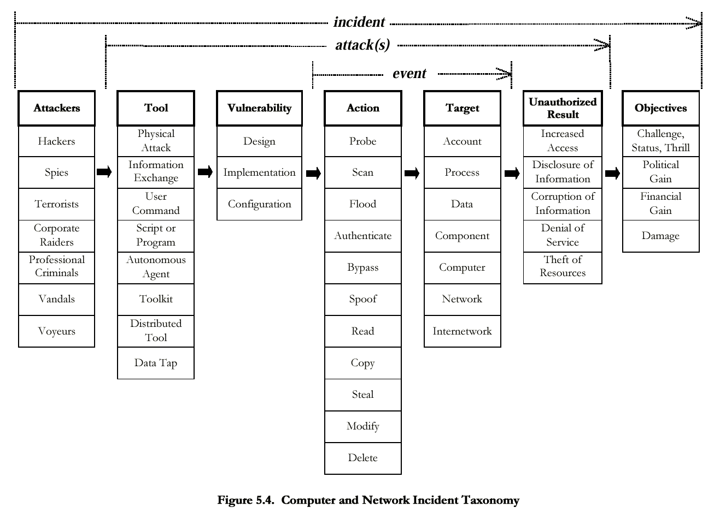

# MLSEC 

github.com/oreilly-mlsec/brook-resources

## Introduction 

[HOW MACHINES ARE LEARNING FOR MODERN AGRICULTURE ?](https://modernag.org/innovation/machine-learning-changing-modern-agriculture/)

<u>Sécu info</u>: domaine qui fournit intrinsèquement les jeux de donnés robustes sur lesquels l’apprentissage automatique prospère. 

<u>*Le ml peut-il mettre un terme au jeu du chat et de la souris ?*</u>

- D’une part, interêt croissant pour le mariage des deux domaines 
- D’autre part, cynisme prononcé &rarr; battage médiatique 

**Meilleure façon de répondre**:
- plonger profondément dans la science 
- comprendre les concepts de base
- faire quantité d’essais et d’expérimentations
- laisser les résultats parler d’eux-mêmes 

Documentation sur l’interaction entre ces sujet existe, mais la plupart sont universitaires ou théoriques ! Exemples:
- [AISec 2018 Berkeley Workshop](http://aisec2018.icsi.berkeley.edu/aisec2018/) 
- [Artificial Intelligence for Cyber Security (AICS)](http://www-personal.umich.edu/~arunesh/AICS2018/) 
- [NIPS: Machine Deception](https://www.machinedeception.com/) 

En outre, pas de guides qui pour éduquer les *sécuriticiens* à la datascience ni pour aider les practiciens de l’apprentissage automatique à réfléchir efficacement aux problèmes de sécu.

<u>*Comment le ML peut augmenter ou __remplacer les solutions heuristiques__ ou __basées sur des règles__ à des problèmes comme __la détection d’intrusion__, __la classification de malwares__ ou __l’analyse réseau__ ?*</u>

___

## Pourquoi le ml et la sécu ?

[Unsung innovators: Gary Thuerk, the father of spam](https://www.computerworld.com/article/2539767/unsung-innovators--gary-thuerk--the-father-of-spam.html)

Les donnés sont importantes pour vaincre les acteurs malveillants et pour améliorer la qualité de nos interaction avec la techno  &rarr; en témoigne les spams 

2 events majeurs:
- explosion du volume de donnés 
- matériels plus puissants

### Paysage des cybermenaces:

- <u>*Vers*</u>: malware qui se réplique et se propage dans le réseau.
- <u>*Spear phishing*</u>: phishing ciblé usant de données glanées à partir de sources extérieures.
- <u>*APT*</u>: ciblage élaborée ou l’intrus rester volontairement furtif pendant une longue période de temps

__La volonté de produire des Malwares est passé d’une économie de réputation à une économie monétaire !__

En raison des enjeux élevés, les institutions critiques mettent en place des mécanismes de défense plus avancé.

De ce fait, les individus malveillants ciblent des entités ayant des mesures de sécurité plus souple pour finalement continuer à faire de l’argent plus facilement.

Il existe des plateformes (légales et illégales) pour acheter des exploits.

Tout comme à l’époque de la ruée vers l’or, les marchands qui fournissent des « équipements » à une population croissante de chercheurs d’ors modernes sont le plus souvent ceux qui profitent des retombées financières que les chercheurs eux-mêmes. 

Page 8 —> liens 

### ML

Volonté d’apprendre aux machines à raisonner et prendre des décisions ➡️ en effectuant des généralisations et en distillant des concepts à partir de jeux d’informations complexes sans instructions explicites.

<u>*Le ML*</u>: ensemble de techniques mathématiques implémentées sur des systèmes informatiques qui permettent de mettre en œuvre un processus d’exploration d’informations, de découverte de modèles et de déduction à partir de données.

➡️ __Apprentissage supervisé__:
(en général) repose sur une approche bayésienne (probabilités d’évènements observés afin d’en déduire les probabilités  d’évènements futurs).

➡️ __Apprentissage non supervisé__:
tirent des abstractions à partir de données non étiquetées afin de les appliquer à de nouvelles données.

Les deux familles de méthodes peuvent résoudre  des pb de type:
- __Classification__ (affection d’observations à des catégories)
- __Régression__ (prédiction de propriétés numériques à partir d’une observation)

Les algos de ml sont pilotés par les maths et les stats (souvent présentés en termes de probabilités et d’intervalles de confiance)

- <u>*Deep learning*</u>: sous ensemble strict du ml qui se réfère à des modèles multicouches.

> Expérimentation et vérification des hypothèses statistiques mises de côté dans le livre.
➡️ voir Probability & Statistics for Engineers & Scientists, Ronald Walpole

> Définition IA ➡️ sujet controversé 

ML ➡️ algos d’analyse statistique capable de créer des abstractions généralisables (modèles) en observant/disséquant un jeu de données.

Méchants aussi utilisent des techniques de ML:
- pour trouver des vulns dans les logiciels (vdiscover.org/OS-fuzzing.html)
- dresser des profils pour élaborer phishing sur mesure (bit.ly/2ENUwB7)
- il y a aussi la question du ml antagoniste (voir Ling Huang, Adversarial ML)

`Reconnaissance de formes != Détection d’anomalies` 

- <u>*Fuzzing*</u>: injecter des données aléatoires dans 

___

## Classification et clustering 

___

## Détection des anomalies 

___

## Analyse de malwares 

___

## Analyse de trafic réseau 

___

## Protéger le Web grand public

___

## Systèmes de production

___

## ML antagonistes

