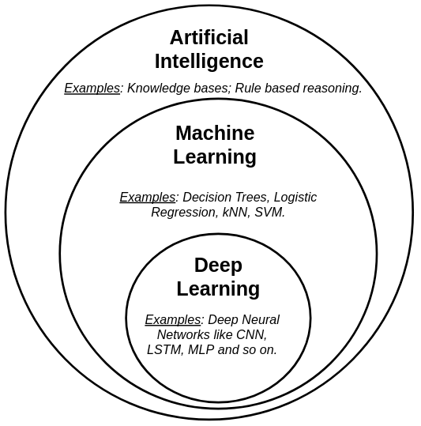
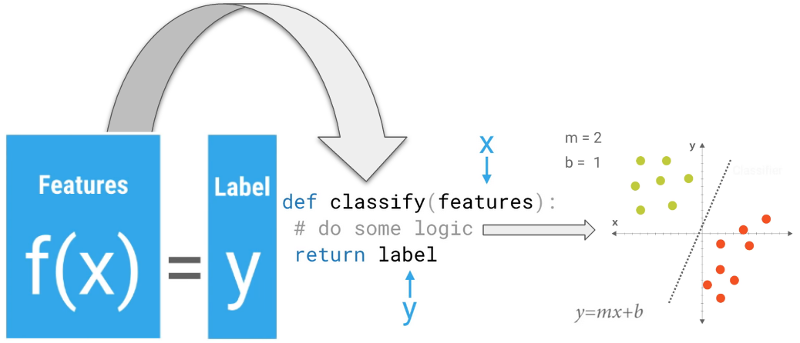

# Summary

- [Some definitions](#some-definitions)
  * [Artificial intelligence](#artificial-intelligence)
  * [What is Machine learning ?](#machine-learning)
  * [Meaning of _"learning"_ for a machine [+ example]](#meaning-of-_learning_-for-a-machine)
- [Training models](#training-models)
- [Supervised learning](#supervised-learning)
  + [Classification](#classification)
    * [Binary classification](#binary-classification)
    * [Multiclass classification](#multiclass-classification)
      + [One versus All or _one versus the rest_](#one-versus-all-or-_one-versus-the-rest_)
      + [One versus One](#one-versus-one)
    * [Multilabel classification](#multilabel-classification)
    * [Multioutput classification](#multioutput-classification)
  + [Regression](#regression)
- [Unsupervised learning](#unsupervised-learning)
- [Semi supervised learning](#semi-supervised-learning)
- [Reinforcement learning](#reinforcement-learning)
- [Scikit-learn API](#scikit-learn-api)
- [Tensorflow API](#tensorflow-api)
  + [Keras API](#keras-api)
- [Useful links](#useful-links)
___

<!-- pagebreak -->

# Some definitions

## Artificial Intelligence

No consensus on the very definition of intelligence, so we can say that it's the art of simulating **natural intelligence** _(human or animal tasks)_ by machines.

<!-- pagebreak -->

## Machine Learning

_"Field of study that gives computers the ability to **learn** without being explicitly programmed."_ **Arthur Samuels (1959)**.

> **Note**: As we can see, this is not a very recent definition. Contrary to popular belief, _**AI**, **Machine learning**, **Deep learning** and **Neural networks**_ are a source of interest for many years.

In other words, **instead of adding rules in a program**, **machine learning algorithms rely on data seen during their training to perform a prediction** _(for instance &rarr; classify images as car photos or not)_ as explained in this [video part](https://www.youtube.com/embed/jmznx0Q1fP0?start=210&end=349).

More precisely, a **ML algorithm will fit a mathematical function that will adjust its parameters with training data** _(or **Training set**)_.

> In this example, the `classify` function adjust the parameters of a line equation. 

### Meaning of _"learning"_ for a machine ?

_"A computer program is said to learn from **experience E** with respect to some class of **tasks T** and **performance measure P**, if its performance at tasks in T, as measured by P, improves with experience E." **Tom Mitchell (1998)**_.

- Example:
  + **T** = playing chess.
  + **E** = playing.
  + **P** = wining _(The % of games won)_.

#### Different types of learning/training

There are 4 main families of machine learning algorithms:

- **Supervised** = data are **already labelled** with the expected predictions when training the model.
- **Unsupervised** = data are **not labelled** with the expected predictions when training the model.
- **Semi supervised** = expected predictions **(labels) are not known for all the data**.
- **Reinforcement** = models are **trained with a reward/punishment system**.

On top of that, there are two ways to train a model: _online and offline learning_.

##### Offline _or Batch_ learning

The system is trained with all available data and just applies what it has learned &rarr; *offline|batch learning*

> **Disadvantage:** need to train a new version of the system from scracth on the full dataset

##### Online learning

The system can learn incrementally.

Data has to be given sequentially, either individually or by mini groups called *mini-batches*.

> Not to be confused with **cross-validation**.

- Technique de [MapReduce](https://fr.wikipedia.org/wiki/MapReduce): diviser l'apprentissage sur plusieurs serveurs.

___

# Training models

> **TODO**
___

<!-- pagebreak -->

# Supervised learning

As explained [before](#different-types-of-learningtraining), supervised learning is ...

Supervised learning algorithms can resolve two types of problem:

- **classification**: assigning to a class.
  + Example: **TODO**.

- **regression**: predicting an amount, a quantity.
  + Example: **TODO**.

## Classification

### Binary classification

Detecting **positive class** and **negative class**.

Examples:
- Classifying mails as spam and non-spam.
- Classifying images as cat or not cat.

> **TODO**: add code

### Multiclass classification

Definition: **TODO**.

> Some algorithms can handle multiple classes natively _(e.g, Naive Baye, SGD, Random Forests...)_.

+ Example: **TODO**

But, there are two main strategies used to **perform multiclass classification using multiple binary classifiers**:

- One versus all
- One versus one

> If you want to force Scikit-Learn to use `one-versus-one` or `one-versus-all`, you can use the `OneVsOneClassifier` or `OneVsRestClassifier`

#### One-versus-All or _One-versus-the-rest_

1. Train **_N_** binary classifiers for each class.
2. For a given instance, get the decision score from each classifier. 
3. Then, select the class whose classifier outputs the highest score.

#### One-versus-One

Train a binary classifier for every pair of class.
   
> If there are _**N**_ classes, you need to train **_N_ × (_N_ – 1) / 2** classifiers.

Example: **TODO**

### Multilabel classification

Outputs multiple binary tags.

Example: **TODO**

### Multioutput classification

Multiclass classification where each label can be multiclass.

Example: **TODO**

### Some principles

**A high-precision classifier is not very useful if its recall is too low!**

> **Note**: increasing precision reduces recall, and vice versa.

A perfect classifier will have a **ROC AUC equal to 1**, whereas a purely random classifier will have a ROC AUC equal to 0.5. 

> **ROC** curve: receiver operating characteristic.

> **AUC**: area under the curve.

## Regression

> **TODO**
___

# Unsupervised learning

> **TODO**
___

# Semi-supervised learning

> **TODO**
___

# Reinforcement learning

> **TODO**
___

# Scikit-learn API

1. **Estimators**: has a `fit()` method.
2. **Transformers**: has a `transform()` method.
3. **Predictors**: has a `predict()` method.

> All **predictors** are **estimators** but the reverse(la réciproque) is not true.

**All the estimator's hyper-parameters are accesible directly via public instance variables !!!**

**Some learning algorithms are sensitive to the order of the training instances, and they perform poorly if they get many similar instances in a row.**

## Some useful classes

- `OneHotEncoder` & `OrdinalEncoder`: for handling text and categorical attributes.
  
> `OrdinalEncoder` will assume that two nearby values are more similar thant two distant values

- `SimpleImputer`: take care of missing values.
- `TransformerMixin` & `BaseEstimator`: for creating a **Transformer** class.
- `Pipeline`: merge Data Tranformers + model
- `ColumnTransformer`: applying the appropriate transformations to each column.
- `GridSearchCV`: (brute-force) finding the bests hyper-parameters _(and so the best(s) estimator(s))_.

> If `GridSearchCV` is initialized with `refit=True` _(which is the default)_, then once it finds the best estimator using cross-validation, **it retrains it on the whole training set**.

- `RandomizedSearchCV`: instead of trying out all possible combinations, it evaluates a given number of random combinations by selecting a random value for each hyper-parameter at every iteration.
- `StandardScaler` : used for standardization _(feature scaling)_.
- `StratifiedKFold` : provides train/test indices to split data in train/test sets.

## Some useful functions

- `cross_val_score`: returns the evaluation scores on each test fold.
- `cross_val_predict`: returns the predictions made on each test fold.
- `confusion_matrix`: returns true/false positives/negatives.

> **A perfect classifier would have only true positives and true negatives**, so its confusion matrix would have nonzero values only on its main diagonal (top left to bootom right).

## Scikit-Learn's Datasets dictionary structure

- **DESCR**: dataset description.
- **data**: array with one row per instance and one column per feature.
- **target**: array with the labels.

>  **skewed datasets**: some classes are much more frequent than others.

## Some notes and tips

- The Scikit-Learn’s _Stochastic Gradient Descent Classifier_ (`SGDClassifier`) has the advantage of being capable of handling very large datasets efficiently. 

> This is in part because SGD deals with training instances independently, one at a time _(which also makes SGD well suited for online learning)_.

- Scikit-Learn does not let you **set the threshold directly**, but it does give you access to the **decision scores** that it uses to make predictions.

- When the positive class is rare, prefer the PR curve.
- When we care more about false positives than false negatives, prefer the PR curve also.  

> the ROC curve otherwise.

- **Scikit-Learn detects when you try to use a binary classification algorithm for a multiclass classification task, and it automatically runs OvA or OvR.**

___

# Tensorflow API

## Keras API
___

# Useful links

- [Scikit-learn ML Glossary](https://scikit-learn.org/stable/glossary.html)
- [Hands-On Machine Learning with Scikit-Learn, Keras, and TensorFlow, 2nd Edition **(Aurélien Géron)**](https://www.oreilly.com/library/view/hands-on-machine-learning/9781492032632/)
- [Coursera: Machine Learning Stanford Online **(Andrew Ng)**](https://fr.coursera.org/learn/machine-learning)
- [Petit voyage au pays du machine learning **(Xavier Dupré)**](http://www.xavierdupre.fr/app/papierstat/helpsphinx/index.html)
- [Machine Learning, Statistiques et Programmation **(Xavier Dupré)**](http://www.xavierdupre.fr/app/mlstatpy/helpsphinx/index.html)
- [NOC-S17-2-Intelligence-Learning notes **(Daniel Shiffman)**](https://github.com/nature-of-code/NOC-S17-2-Intelligence-Learning/tree/master/week3-classification-regression)
- [Udacity: school of ai](https://www.udacity.com/school-of-ai)