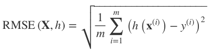
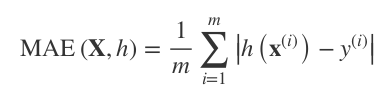

- Qu'est-ce que le feature scaling ?
- Quels sont les différents types de distribution (Gaussian, uniform, logarithmic, etc.) ?
- Quels sont les différents types de bruit (stochastic, outliers, rounding errors, etc.) ? 
- Quels sont les différents types d'erreurs ?
  * Pour les problèmes de régresions, il existe plusieurs mesures de performance. Parmi lesquelles:
    + l'erreur **RMSE** (**R**oot **M**ean **S**quared **E**rror) (&rarr; distance euclidienne):
      - _m_ est le nombre d'instances.
      - **x**^_i_ est la _i_-ème instance &rarr; vecteur de caractéristiques.  
      - **y**^_i_ est l'étiquette de la _i_-ème instance.
      - **h** est la fonction de prédiction, _aussi appelée l'**hypothèse**_. Il s'agit tout simplement du modèle utilisé. Le résultat de cette fonction est souvent noté **ŷ**.
    
    
    
    + l'erreur **MAE** (**M**ean **A**bsolute **E**rror) (&rarr; distance de manhattan):
    
    
