# Networks

## Summary

[Introdution](#introduction)

1. [Equipments](#1-networking-equipment) (router, switch...)
2. [Structures](#n2-etworking-structures)
    + [Types](#21-types) (LAN/WAN, VPN/Proxy...)
    + [Topologies](#22-topologies) (Mesh, Tree, Star, Ring...)
3. [Protocols](#3-protocols) (TCP/UDP/IP...)
4. [Addressing](#4-addressing)
    + [Subnetting](#subnetting)
5. [Web](#5-web)
6. [Security](#6-security)
7. [+Concepts](#7-concepts)

[Resources](#resources)

___

## Introduction

We can define a network as <u>a group of computers capable of communicating with each other</u>.

**Internet** can be considered as a <u>network of networks</u>! 

> Indeed, it is a _interconnection_ of many subdivided networks.

> Not to be confused with the web _(or [World Wide Web](https://en.wikipedia.org/wiki/World_Wide_Web))_ which is just websites available over the Internet.

When we interact with Internet, we're constantly sending/receiving **packets**.

Each machine connected to Internet has an **IP address** (which is a kind of a geographical position).

Think of a **router** as a <u>post office</u> and Internet Service Providers (**ISP**) as the main post office. 

> In the diagram above, regarding the _Company Network_, the five machine represent five separate networks. 

___

## 1. Networking equipment

To enable communication, we need mediums (ethernet/fiber/coax/wireless...) and equipments:

> Crossover cables are used to directly connect two computers while straight cables are used to connect a computer to another device such as a hub or a switch.

Equipment                                  | Image | Definition     |
-------------------------------------------|-------|----------------|
**Router**/Modem                           | 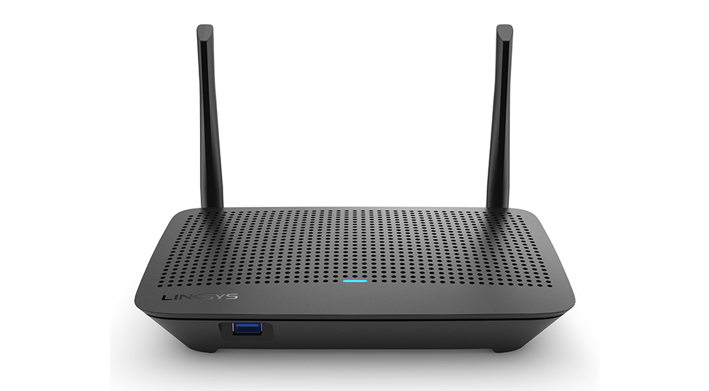 | allows communication between different networks (exemple: local network and Internet) |
**Switch**                                 | 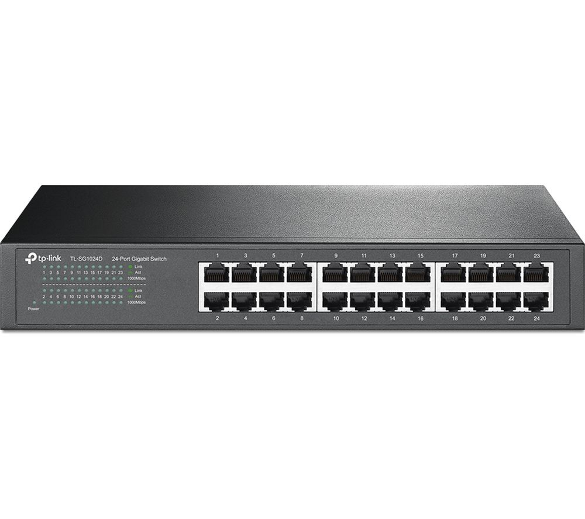 | allows to link several computers together. By relying on their physical addresses (MAC addresses), the switch transmits to each machine only what is addressed to it (unlike the **Hub**) |
Network interface controller/card (**NIC**)| 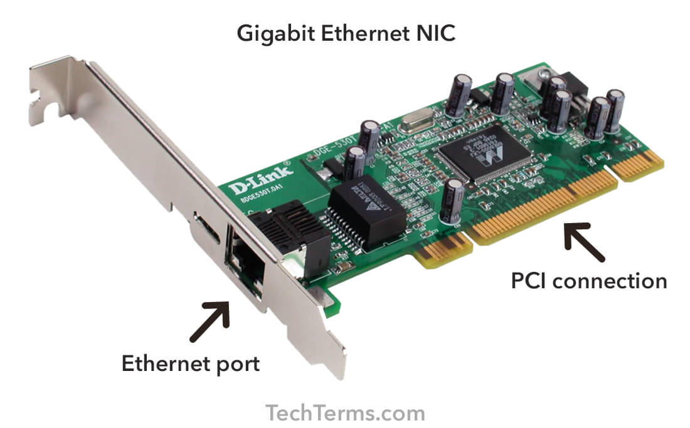 | deals with everything related to network communication |

MAC are physical addresses while IP are logical addresses. These notions will be discussed in more detail later.

> Of course, there are also repeaters.

> _A router does not necessarily have antennas as in the image below._

**Wired connections**: Coaxial cabling, Glass fiber cabling, Twisted-pair cabling etc.

**Wireless connections**: Wi-Fi, Cellular (3G/4G/5G), Satellite etc.

___

## 2. Networking structures

### 2.1. Types

Network Type 	            | Definition
----------------------------|--------------
Local Area Network (`LAN`)  | Internal Networks (Ex: Home or Office)
Wide Area Network (`WAN`)   | a large number of LANs joined together (Internet/Intranet for instance)

**Note**: Generally, in an internal network (LAN), machines are not directly exposed to the Internet. They only have **Private IP Addresses** while the router may have a <u>LAN Address</u> (Private IP) to communicate with them, and a <u>WAN Address</u> (**Public IP**) to communicate with Internet. These notions will be discussed in more detail later.

> **WLAN** is the acronym of Wireless Local Area Network.

> _In books, we can come across with terms like Global Area Network (`GAN`), Metropolitan Area Network (`MAN`), Personal Area Network (`PAN`) and its wireless variant (`WPAN`). However, they are more academical terms than operational terms)_.

> A way to identify if the network is a WAN is to use a WAN Specific routing protocol such as `BGP` and if the IP Schema in use is not within **RFC 1918** (`10.0.0.0/8`, `176.16.10.0/10`, `192.168.0.0/16`).

#### VPN

- **VPN** (Virtual Private Networks) is just a way to access to another LAN (like you were plugged into it), although you are connected to a primary network.

There 3 main types of VPNs:

1. **Site-To-Site**: (most commonly used to join company networks) both the client and server are Network Devices and share entire network ranges..
2. **Remote access VPN**: client's computer create a virtual interface that behaves as if it is on a client's network (`tun0` on Linux for example).
3. **SSL VPN**: stream applications or entire desktop sessions within the web browser.

A VPN can be used to obfuscate/"hide" your location, because your IP address used for web requests will be located in the other LAN you are connected to.

#### Proxy

- A **proxy** is when a device or service sits in the middle of a connection and acts as a <u>mediator</u> (inspects traffic's content). A proxy does not necessary change your IP address!

> Without the ability to be a mediator, the device is technically not a proxy, just a **gateway**.

Key types of proxy services:

Type of proxy                     | Image          | Definition
--------------------|----------------|-----------
`Forward Proxy`     | 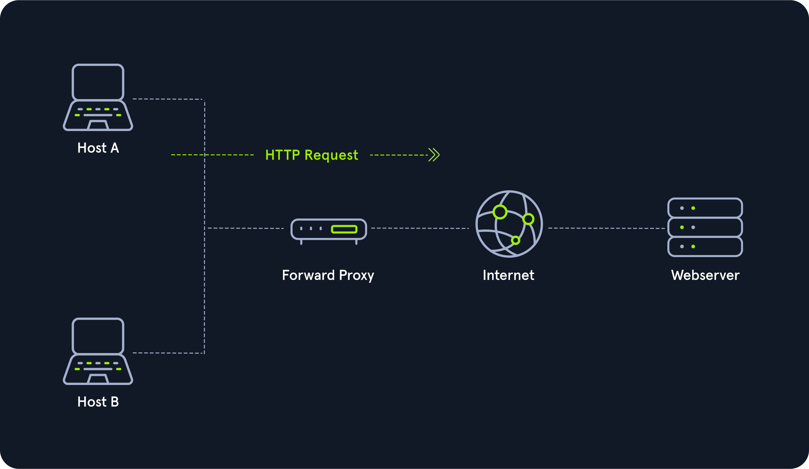 | client makes a request to the proxy, and that proxy carries out the request. (Mainly used in companies networks)|
`Reverse Proxy`     | 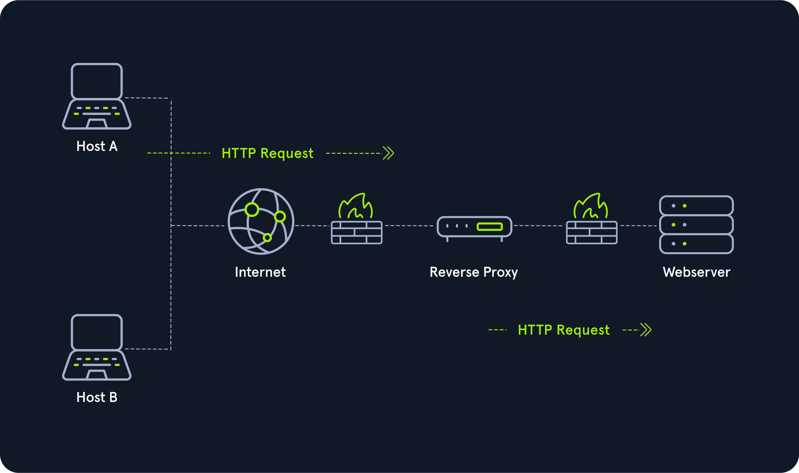 | The reverse of a `Forward Proxy`, instead of being designed to filter outgoing requests, it filters incoming ones. (Examples: `CloudFlare`, `ModSecurity`) |

> **Note**: Malwares that want to bypass `forward proxy` need to be `proxy aware` or use a non-traditional `C2` (a way to receive tasking information) like `DNS`. On Windows, web browsers like Internet Explorer, Edge, or Chrome all obey the "System Proxy" settings by default. If the malware utilizes `WinSock` (Native Windows API), it will likely be `proxy aware` <u>without any additional code</u>. Firefox rely on `libcurl` instead (enables to use the same code on any OS). In that case, in order to be `proxy aware`, malwares would need to look for Firefox and pull the proxy settings.

>  Monitoring DNS can be done with [`Sysmon`](https://medium.com/falconforce/sysmon-11-dns-improvements-and-filedelete-events-7a74f17ca842)

Proxies act either **non-transparently** (communication partner) or **transparently** (client doesn't know about its existence).

### 2.2. Topologies

A **topology** corresponds to the way devices in a network are physically and/or logically connected to each other.

It determines the access methods to the transmission media.

Topology            | Image                         | Description
--------------------|-------------------------------|--------------
**Point-to-Point**  |          | Direct physical link exists between two hosts |
**Bus**             | 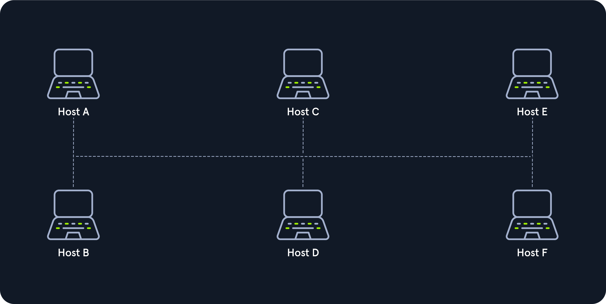         | All hosts are connected via a transmission medium in the bus topology. Since the medium is shared with all the others, only one host can send, and all the others can only receive and evaluate the data and see whether it is intended for itself. (Exemple: coaxial cable) |
**Star**            | 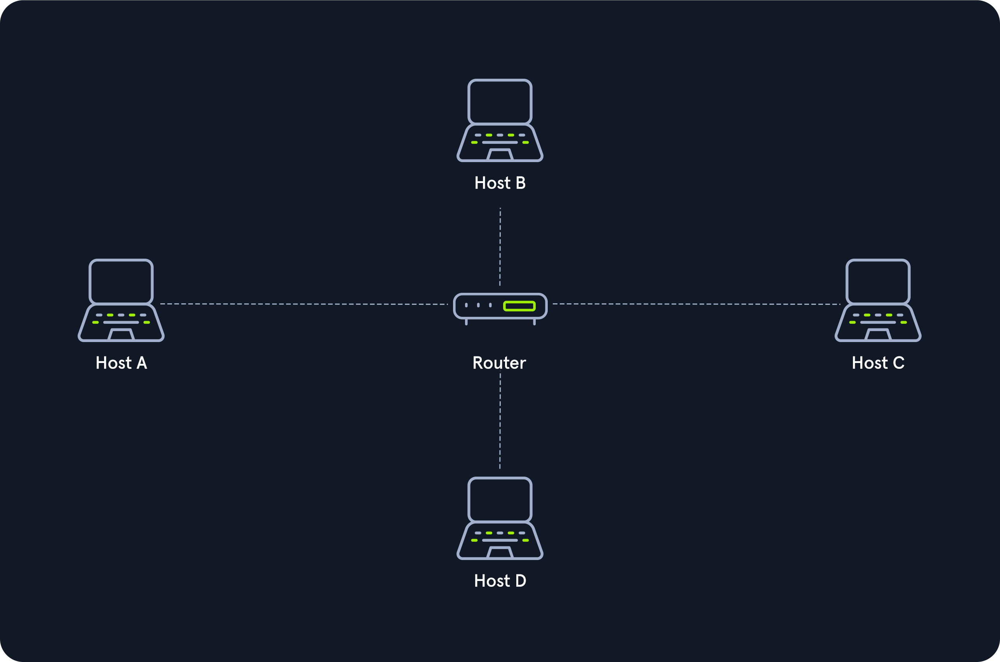        | Each host is connected to the <u>central network component</u> via a separate link |
**Ring**            | 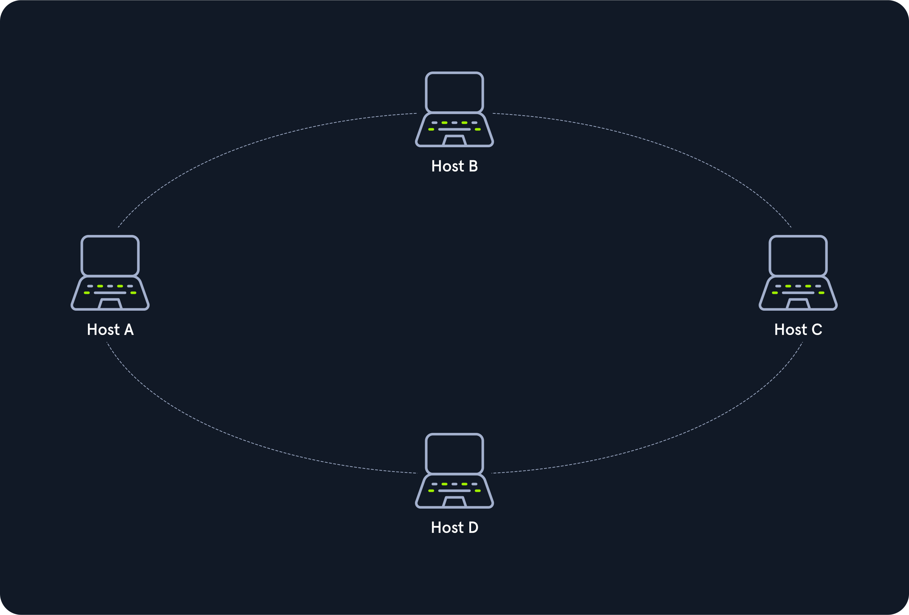        | Each host is connected to the ring with two cables (one for the incoming traffic, one for the outgoing). _The logical ring topology works with a `token`._ |
**Mesh**            | 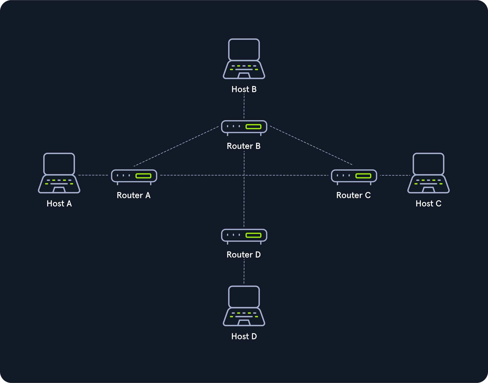        | Each host is connected to every other host in the network in a **fully meshed structure**. In the **partially meshed structure**, the endpoints are connected by only one connection. |
**Tree**            | 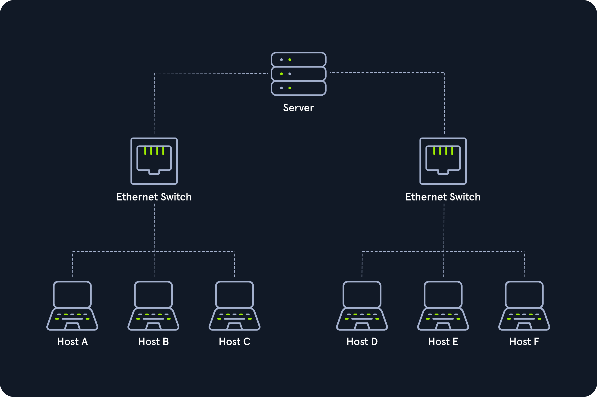        | Extended star topology |
**Daisy Chain**     | 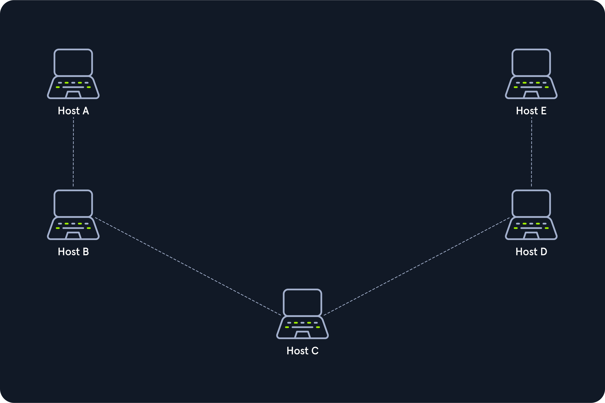 | (often found in automation technology like `CAN`) Multiple hosts are connected by placing a cable from one node to another. The signal is sent to and from a component via its previous nodes to the computer system |
**Hybrid**          | 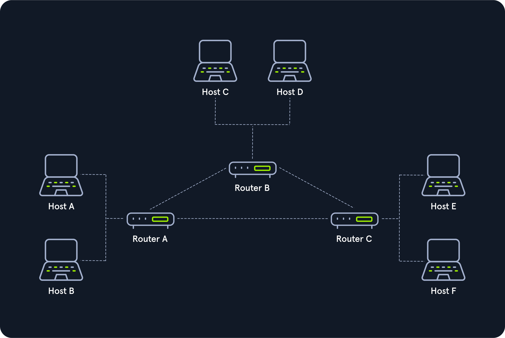      | Hybrids of two or more of the basic topologies mentioned above. _Internet has an hybrid topology,_|

> Do not confuse Point-to-Point and `P2P` (**Peer-to-Peer** architecture)

> Check [spanning tree](https://en.wikipedia.org/wiki/Spanning_Tree_Protocol)

___

## 3. Protocols

A **protocol** corresponds to the rules for communication.

>  IoT (Internet of Things) protocols: `Insteon`, `Z-Wave`, and `ZigBee`.
___

## 4. Adressing

MAC

IP public vs private  (RFC 1918, 10.0.0.0/8, 176.16.10.0/10, 192.168.0.0/16)

### 4.X. Subnetting

#### Mask

> The `/24` network allows computers to talk to each other as long as the first three octets of an IP Address are the same (ex: 192.168.1.xxx)

___

## 5. Web

**HTTP**

Uniform Resource Locator (**URL**)

Domain Name(**DN**) translated into an IP address via **DNS**

___

## 6. Security

Taking the time to map out and document each network's purpose

**Firewalls**

**Web Application Firewalls** (`WAF`) inspect web requests for malicious content and block the request if it is malicious. _(Read: [OWASP ModSecurity Core Rule Set](https://owasp.org/www-project-modsecurity-core-rule-set/) to get started)_

**Intrusion Detection Systems** (`IDS`) like `Suricata` or `Snort`

**DMZ** (Demilitarized Zone)

**Spoofing**

**Snooping** in on any communication between these devices

eavesdrop

**Man In The Middle** (MITM)

**DoS** (Denial of Service)

OSPF (Open Shortest Path First) advertisements

> routers should have a trusted network
___

## 7. +Concepts

QoS (Quality of Service: prioritize their traffic to prevent high latency more easily)
___

## Resources

- [**code.org**: How Computers Work?](https://www.youtube.com/playlist?list=PLzdnOPI1iJNcsRwJhvksEo1tJqjIqWbN-) 
- [**code.org**: How The Internet Works?](https://www.youtube.com/playlist?list=PLzdnOPI1iJNfMRZm5DDxco3UdsFegvuB7)
- [**Openclassrooms**: Les réseaux de zéro](https://openclassrooms.com/fr/courses/1561696-les-reseaux-de-zero)
- [**HTB Academy**: Introduction to Networking](https://academy.hackthebox.eu/course/preview/introduction-to-networking)
- [COMMENT DÉTRUIRE INTERNET dans le MONDE ?](https://www.youtube.com/watch?v=6hNCEQpjKqE)