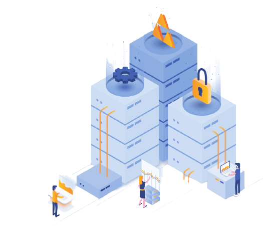
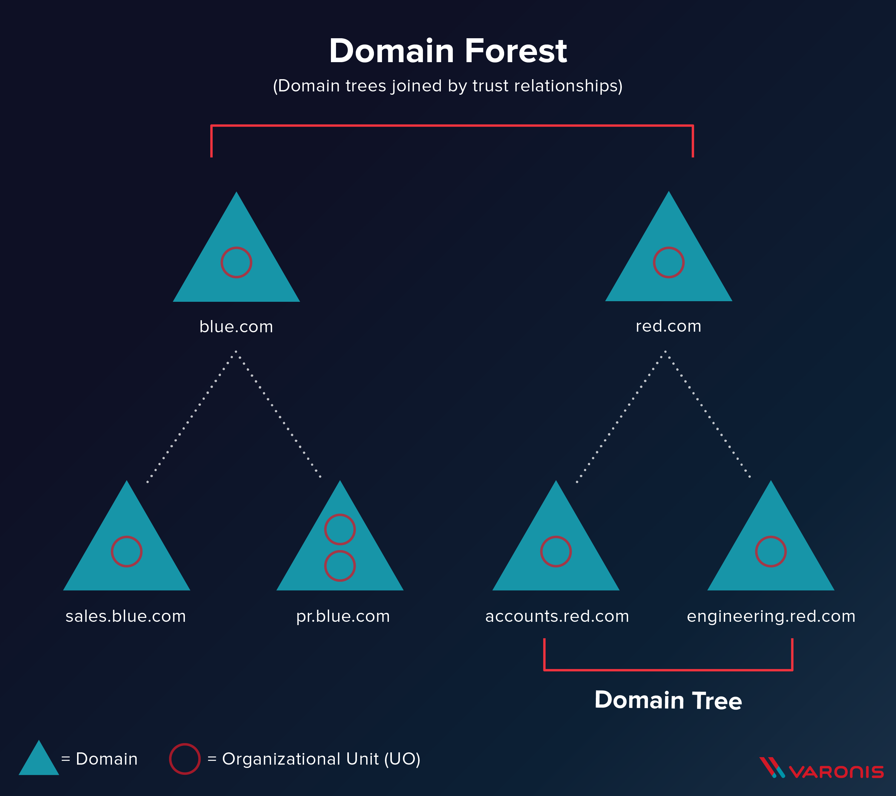

# Active Directory

**Active Directory** is the directory service for Windows Domain Networks.

> directory service = service d'annuaire

It's basically a collection of machines connected inside of **domains**.

Generally, domains are a part of a bigger **forest** of domains, that make up the <u>Active Directory network</u>. 

Large companies use Active Directory because it allows control and monitoring of user's computers through a single **domain controller**.

Users can connect from any computer owned by the company to the Active Directory, and then access his/her files stored on the server, as well as the local storage of the machine he/she is using.

There are two types of Active Directory:

1. On-Premise Active Directory (**AD**)
2. Azure Active Directory (**AAD**) &rarr; full cloud

___

## Active Directory main components

Component                    | Description 
-----------------------------|----------------------------------------------------------------------------------------------------------
**Objects**                  | Users, groups, printers, computers, shares, etc.
**Domain**                   | Used to group and manage objects. <ul><li>**Domain Services**: DNS Server, LLMNR, IPv6 ...</li><li>**Domain Schema**: Rules for object creation</li></ul>
**Domain Controller**(DC)    | Windows server that has **Active Directory Domain Services** (AD DS). This is the most important server &rarr; it can handle authentication and authorization, replicate updates from other DC, restrict actions, improve security, and more.
**Organizational Units**(OUs)| Containers for groups, computers, users, printers and other OUs
**Trees**                    | Hierarchy of domains in AD DS 
**Forest**                   | Collection of one or more trees inside of an Active Directory network
**Trusts**                   | Allows users to access resources in other domains
**Policies**                 | (apply to a domain as a whole) dictates how the server operates and what rules it will follow.

### AD DS Data Store

The Active Directory Data Store holds the databases and processes needed to store and manage directory information such as users, groups, and services.

It contains `NTDS.dit` which is the database that contains all the information of a DC (as well as **password hashes**)
- By default, it is stored in `%SystemRoot%\NTDS`

> Obviously it's only accessible by the domain controller

___

## Users

By default there are two users: `Administrator` and `guest`.

4 main types of users:
1. **Domain Admins**: only ones with access to the domain controller.
2. **Service Accounts**: required by Windows for services such as SQL to pair a service with a service account.
3. **Local Administrators**: users that can make changes to local machines and may even be able to control other normal users _(but they cannot access the domain controller)_.
4. **Domain Users**

___

## Groups

Groups make it easier to manage users and to organize them with specified permissions.

2 main types of groups:
1. **Security Groups** &rarr; used to specify permissions for a large number of users
2. **Distribution Groups** &rarr; specify email distribution lists _(can be useful for enumeration)_

### Default Security Groups 

Security Group | Description
------- | -------
Domain Controllers | All domain controllers in the domain
Domain Guests | All domain guests
Domain Users | All domain users
Domain Computers | All workstations and servers joined to the domain
Domain Admins | Designated administrators of the domain
Enterprise Admins | Designated administrators of the enterprise
Schema Admins | Designated administrators of the schema
DNS Admins | DNS Administrators Group
DNS Update Proxy | DNS clients who are permitted to perform dynamic updates on behalf of some other clients (such as DHCP servers).
Allowed RODC Password Replication Group | Members in this group can have their passwords replicated to all read-only domain controllers in the domain
Group Policy Creator Owners | Members in this group can modify group policy for the domain
Denied RODC Password Replication Group | Members in this group cannot have their passwords replicated to any read-only domain controllers in the domain
Protected Users | Members of this group are afforded additional protections against authentication security threats. See http://go.microsoft.com/fwlink/?LinkId=298939 for more information.
Cert Publishers | Members of this group are permitted to publish certificates to the directory
Read-Only Domain Controllers | Members of this group are Read-Only Domain Controllers in the domain
Enterprise Read-Only Domain Controllers | Members of this group are Read-Only Domain Controllers in the enterprise
Key Admins | Members of this group can perform administrative actions on key objects within the domain.
Enterprise Key Admins | Members of this group can perform administrative actions on key objects within the forest.
Cloneable Domain Controllers | Members of this group that are domain controllers may be cloned.
RAS and IAS Servers | Servers in this group can access remote access properties of users

___

## Domain Trusts

Trusts are a mechanism which outline the way that domains inside of a forest communicate to each other. In some environments, it can be extended out to **external domains** and even forests.

2 types of Trusts:
1. **Directional**: flows from a trusting domain to a trusted domain
2. **Transitive**: expands to include other trusted domains

___

## Domain Policies

Domain Policies act as a rulebook for Active Directory that apply to a domain.

> Group Policies
___

## Authentication

Authentication consists of verifying that a person _(or an object or a service)_ is who they claim to be.

### Local authentication

Local authentication is done using the **L**ocal **S**ecurity **A**uthority (**LSA**). 

LSA is a protected subsystem that keeps track of the security policies and the accounts that are on a computer system. 

It also maintains information about all aspects of local security on a computer.

#### Authentication on On-Premise AD

On-premise Active Directory has a record of all users, PCs and Servers.

**AD** authenticates the users signing in (via the network logon). 

Once signed in, AD governs users groups, allowing them to do or to access (authorization).

In an on-premise Active Directory environment, the following protocols are used during the authentication process:

- **NTLM**
- **LDAP** 
- **Kerberos**

##### NTLM / NTLM 2 

NTLM is the default Windows authentication protocol.

It is based on a challenge-response sequence of messages between a client and a server system.

It does not provide **data integrity** or **data confidentiality** protection for the authenticated network connection.

> Take a look at the tool `Responder`

> Take a look at `Pass The Hash`

##### LDAP(S)

**LDAP** - Lightweight Directory Access Protocol; provides communication between applications and directory services.

> **LDAPS** support encryption while **LDAP** send credentials in plaintext.

Using LDAP/LDAPS the user's workstation sends the credentials using an API to the Domain Controller in order to validate them and be able to log in.

- The **Domain Controller** (**DC**) can be considered as a database of users, groups, computers and so on.

##### Kerberos

Default authentication service for Active Directory uses ticket-granting tickets and service tickets to authenticate users and give users access to other resources across the domain.

___

### Remote authentication

The most notable AD cloud provider is Azure AD.

#### Authentication on Azure Active Directory

**Azure Active Directory** is a secure online authentication store, which can contain users and groups. 

> All of the Microsoft Cloud services use Azure Active Directory for authentication: Office 365, Dynamics 365 and Azure.

**Azure Active Directory** supports the following authentication methods:

- **SAML** (Security Assertion Markup Language)
- **OAuth 2.0**
- **OpenID Connect**

##### SAML (Security Assertion Markup Language)

SAML defines a set of rules/protocols that allow users to access web applications with a single login.

> This is called Single Sign-On (**SSO**) standard.

These applications are **Service Providers** that trust the **Identity Provider** (system that performs user authentication).

##### OAuth 2.0

OAuth 2.0 is a standard that apps use to provide client applications with access.

It has four major components:

1. **Authorization server**: issues the access token
2. **Resource owner**: grants permission to access the resource server with an access token
3. **Client**:  requests the access token, and then passes it to the resource server
4. **Resource**/Application: accepts the access token and must verify that it is valid

##### OpenID Connect

Built on top of OAuth 2.0, it adds another token called **ID token** which is just a **JWT Token** (JSON Web Token).

___

On-premise AD | Azure AD
------- | -------
LDAP | Rest APIs
NTLM | OAuth/SAML
Kerberos | OpenID
OU Tree | Flat Structure
Domains and Forests | Tenants
Trusts | Guests
___

## Useful links / Resources

- [Hackndo - Active Directory articles](https://beta.hackndo.com/archives/#active-directory)
- [THM - intro2windows room](https://tryhackme.com/room/intro2windows)
- [Academy HTB - Active Directory LDAP](https://academy.hackthebox.eu/course/preview/active-directory-ldap)
- [Attacking Active Directory: 0 to 0.9](https://zer1t0.gitlab.io/posts/attacking_ad/)
- [ANSSI - Recommandations de sécurité relatives à Active Directory](https://www.ssi.gouv.fr/guide/recommandations-de-securite-relatives-a-active-directory/)
- [CERT-FR - Points de contrôle Active Directory](https://www.cert.ssi.gouv.fr/uploads/guide-ad.html)
- [PowerView-3.0-tricks.ps1](https://gist.github.com/HarmJ0y/184f9822b195c52dd50c379ed3117993)